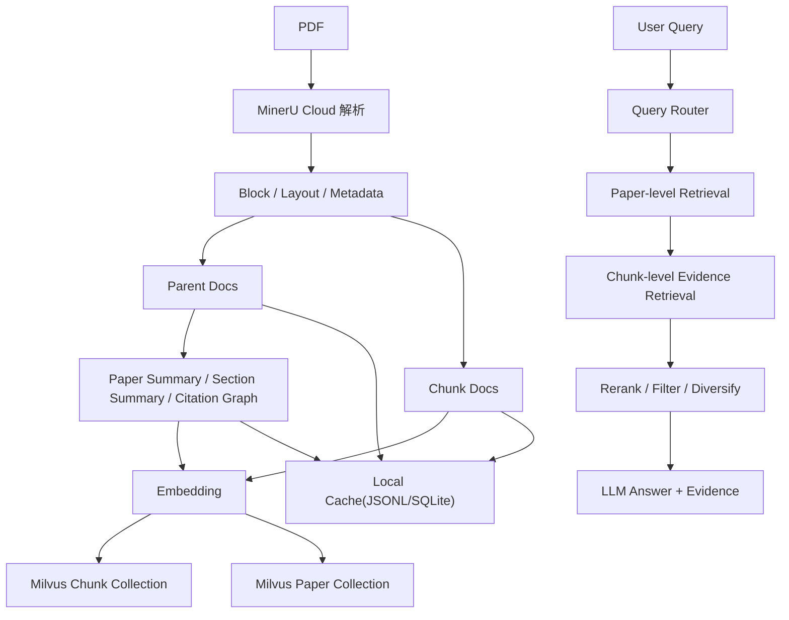

# PaperRAG

面向论文 PDF 的工程化 RAG 知识库系统。

这个项目的目标不是做一个“上传 PDF 然后调用大模型”的演示，而是把论文知识库真正拆成可维护的工程链路：文档解析、结构化切块、增量入库、双层检索、证据追踪、引用网络、参数调优和离线评测。

## 项目定位

PaperRAG 解决的是“私有论文集合上的可追踪问答与检索”问题，适合以下场景：

- 批量导入本地论文 PDF，构建可持续更新的知识库
- 针对论文内容做问答、对比、综述、元数据查询、参考文献追踪
- 返回带页码、章节、证据片段的答案，而不是只给自然语言总结
- 用统一的检索链路支撑命令行、Streamlit UI 和 Colab Benchmark

## 核心能力

- 论文 PDF 结构化解析：抽取标题、作者、年份、关键词、章节、bbox、参考文献区
- 增量入库：按 `doc_id` 做 upsert / delete，不依赖每次全量重建
- 双层索引：同时维护 `paper-level` 与 `chunk-level` 检索语料
- 多路检索：支持 `dense`、`bm25`、`hybrid`
- Query Router：根据问题类型切换不同检索策略
- Metadata Filter：支持作者、标题、venue、年份、关键词等显式约束
- 引用网络：从参考文献条目中抽取 citation edge，支持引用追踪
- 一致性保护：本地 cache、paper catalog、Milvus collection 联动校验
- 证据可追踪：答案附带来源论文、页码、章节、块级证据

## 技术栈

- Python 3.12
- LangChain
- MinerU Cloud
- HuggingFace Embedding，默认 `BAAI/bge-m3`
- Milvus / Zilliz Cloud
- BM25
- RRF 融合
- `BAAI/bge-reranker-base`
- Streamlit
- SQLite + JSONL 本地 catalog / cache
- Colab Notebook + Qasper Benchmark

## 系统架构



## 实现路径

### 1. 文档解析与结构化入库

入口在 [`main.py`](main.py) 的 `ingest` 命令，主流程在 [`pipeline.py`](pipeline.py)。

解析阶段由 [`ingestion/pdf_loader.py`](ingestion/pdf_loader.py) 负责，主要工作包括：

- 调用 MinerU Cloud 拿到结构化 `content_list`
- 生成 block 级文本与布局信息
- 抽取论文元数据：标题、作者、年份、venue、关键词、语言
- 识别参考文献区与正文区
- 保留 `page / bbox / section_path / block_id / doc_id`

切块阶段由 [`ingestion/chunking.py`](ingestion/chunking.py) 负责，默认使用 `semantic_paper` 策略：

- 优先保留语义完整的 parent block
- 只有超长段落才回退到 token 级切块
- 同时构建 `parent_docs` 和 `chunk_docs`

入库阶段会同时生成 5 类持久化资产：

- `chunk_corpus.jsonl`
- `parent_corpus.jsonl`
- `paper_corpus.jsonl`
- `section_summary_corpus.jsonl`
- `paper_catalog.sqlite3`

其中 paper 级资产由 [`services/paper_representation.py`](services/paper_representation.py) 构建，catalog 写入由 [`services/paper_catalog_store.py`](services/paper_catalog_store.py) 完成。

### 2. Paper-level + Chunk-level 双层检索

这个项目的关键设计之一，是不是只在 chunk 上做检索，而是先做论文级召回，再做证据级召回。

对应实现：

- [`services/paper_representation.py`](services/paper_representation.py)
- [`retrieval/vector_store.py`](retrieval/vector_store.py)
- [`services/retrieval_service.py`](services/retrieval_service.py)

具体做法：

- 为每篇论文构建 `paper summary`
  - 标题
  - 作者
  - 年份
  - venue
  - 关键词
  - abstract
  - section summary
  - citation 线索
- 独立写入 `paper` collection
- 查询时先召回 top papers
- 再用这些 `doc_id` 约束 chunk evidence 检索

这样做的好处是：

- 宽问题不容易被某个局部 chunk 带偏
- 综述类、比较类问题更容易先找到正确论文集合
- 元数据型问题可以直接走 paper/catalog 信息，不必强依赖正文 chunk

### 3. Query Router

不是所有问题都走同一条链路。问题路由在 [`retrieval/query_router.py`](retrieval/query_router.py)，当前区分 5 类：

- `factual`(事实型)
- `comparison`(比较型)
- `survey`(综述型)
- `metadata`(元数据)
- `references`(参考文献)

路由结果会影响：

- paper-level 是否优先
- top-k 策略
- 检索模式
- prompt 模式
- 是否只看 references

主检索编排在 [`services/retrieval_service.py`](services/retrieval_service.py)。

### 4. Hybrid Retrieval + Query Rewrite + Metadata Filter

检索层的核心不在“调用一个 retriever”，而在组合多种召回与过滤策略。

#### Hybrid Retrieval

检索器在 [`retrieval/retriever.py`](retrieval/retriever.py)，支持：

- `dense`
- `bm25`
- `hybrid`

其中 `hybrid` 通过 RRF 融合 dense 与 BM25 结果：

- dense 负责语义召回
- BM25 负责精确术语、模型名、数据集名、指标名
- RRF 避免不同检索器分数难以直接对齐的问题

#### Query Rewrite

Query Rewrite 在 [`retrieval/query_rewrite.py`](retrieval/query_rewrite.py)，当前不是 LLM 改写，而是规则式多变体扩展：

- 去掉问句套话
- 生成关键词查询
- 补充中英术语
- 扩展学术缩写
- 生成多个 query variant 后做融合

优点是稳定、低成本、可控，不会引入额外幻觉。

#### Metadata Filter

Metadata Filter 在 [`retrieval/metadata_filter.py`](retrieval/metadata_filter.py)，支持：

- `author`
- `title`
- `venue`
- `year`
- `source`
- `keyword`

不仅支持精确年份，还支持时间范围与相对时间表达，并且会把命中的 `doc_id` 约束尽量下推到 Milvus 检索阶段，而不是只做候选后过滤。

### 5. Rerank、证据过滤与多样性控制

召回之后还会做一层证据编排，逻辑在 [`services/retrieval_service.py`](services/retrieval_service.py) 和 [`retrieval/retriever.py`](retrieval/retriever.py)：

- score filtering
- reranker
- 去重
- source diversification
- 每篇论文最多保留若干 chunk
- 对比较型问题做补召回

目标不是单纯提高召回数，而是让最终喂给生成模型的证据集合更稳定、更少重复、更适合回答。

### 6. 引用网络与参考文献检索

论文知识库不应该只看正文，这个项目专门保留了 references 路径。

实现位置：

- [`ingestion/reference_detection.py`](ingestion/reference_detection.py)
- [`services/paper_representation.py`](services/paper_representation.py)
- [`services/local_cache_store.py`](services/local_cache_store.py)

当前支持：

- 识别 reference section
- 生成 reference chunk
- 构建 citation edge
- 在 `references` scope 下只检索参考文献条目

这使得系统可以回答：

- 这篇论文引用了哪些工作
- 某方法在库里被哪些论文引用
- 某篇论文是否出现在另一篇论文的参考文献中

### 7. 一致性与增量更新

这个项目不是“每次删除本地目录重建索引”的 demo，而是做了知识库一致性控制。

关键模块：

- [`services/sync_transaction.py`](services/sync_transaction.py)
- [`services/knowledge_base_guard.py`](services/knowledge_base_guard.py)
- [`services/local_cache_store.py`](services/local_cache_store.py)

当前机制包括：

- 本地 cache 与远端 Milvus 的 journal 式同步
- `remote_pending / local_pending` 分阶段恢复
- `ask` 只做轻量校验，不偷偷修库
- `ingest` 负责重建和远端补齐
- 缺少 `paper` 索引时明确提示先执行 `ingest`

## 项目特色

这部分是这个项目和普通 “Chat with PDF” 最大的差异。

### 1. 不是纯 chunk 检索，而是 paper-first 检索

系统不是直接把问题扔给向量库拿 chunk，而是：

- 先找相关论文
- 再在论文内部找证据

这让系统更像“论文知识库”，而不是“文本碎片搜索器”。

### 2. 本地论文库与公开 Benchmark 共用同一套检索核心

本地主程序负责私有论文知识库问答，Colab 侧的 Benchmark 复用同一套核心检索逻辑：

- Notebook: [`notebooks/PaperRAG_Qasper_Eval_Colab.ipynb`](notebooks/PaperRAG_Qasper_Eval_Colab.ipynb)
- Benchmark: [`colab_eval/dataset_benchmark.py`](colab_eval/dataset_benchmark.py)

这意味着参数调优不是拍脑袋，而是可以先在 Qasper 上做 A/B，再迁回私有知识库。

### 3. 元数据、引用、摘要三层信息同时保留

系统不是只保留原始 chunk，而是同时维护：

- `chunk-level evidence`
- `section summary`
- `paper summary`
- `paper catalog`
- `citation graph`

这让系统可以覆盖：

- 正文事实问答
- 跨论文比较
- 综述型问题
- 元数据查询
- 参考文献追踪

### 4. 强工程可维护性

项目强调的是可维护知识库，而不是一次性 demo：

- 增量入库
- 删除指定论文
- 本地 cache
- paper catalog
- startup health check
- 同步恢复
- 进度可视化 ingest

## 运行方式

### 命令行

```bash
python main.py ingest
python main.py ask "这篇论文用了哪些数据集做实验？"
python main.py chat
python main.py delete-doc <doc_id>
python main.py health
```

### Web UI

```bash
streamlit run app/streamlit_app.py
```

### Colab Benchmark

- Notebook: [`notebooks/PaperRAG_Qasper_Eval_Colab.ipynb`](notebooks/PaperRAG_Qasper_Eval_Colab.ipynb)
- Benchmark 逻辑: [`colab_eval`](colab_eval)

## 项目结构

```text
app/            Streamlit 前端
colab_eval/     Colab 侧 Benchmark 逻辑
generation/     LLM 客户端与 Prompt 构建
ingestion/      PDF 解析、切块、Embedding
retrieval/      检索器、向量库、过滤器、改写器、路由器
services/       检索编排、catalog、同步、一致性控制
tests/          检索、路由、元数据、引用相关测试
notebooks/      Colab Notebook 与评测输出
pipeline.py     入库 / 删除 / 问答主流程
main.py         CLI 入口
```

## 适合作为简历项目的点

如果从简历视角总结，这个项目的价值不在“接了几个模型接口”，而在于做了一套完整的论文知识库系统：

- 把 PDF 解析、双层索引、混合检索、元数据过滤、引用网络和问答生成串成统一工程链路
- 支持增量入库、删除、同步恢复和一致性校验，能长期维护知识库而不是一次性跑通
- 在私有知识库之外，提供可复现的 Colab Benchmark，用公开数据集驱动检索参数优化
- 让答案具备论文来源、页码、章节、证据块追踪能力，满足研究场景对可解释性的要求

