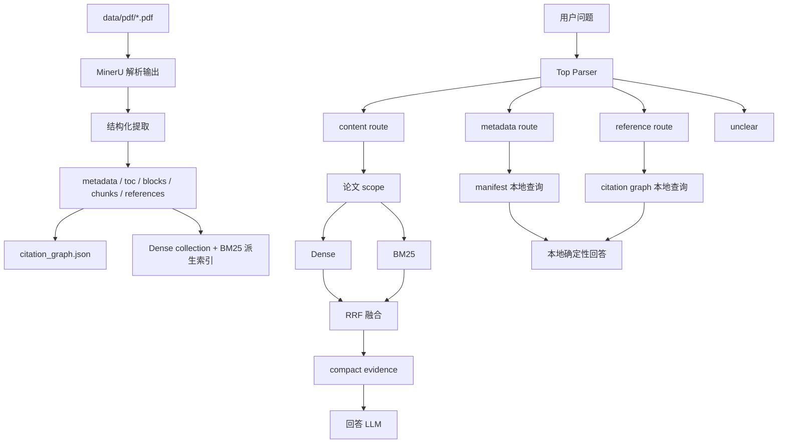

# Paper_RAG

## 1. 项目定位

Paper_RAG 是一个面向本地论文库的结构化 RAG 项目

它不只是把 PDF 切块后塞进向量库，而是先把论文整理成可追溯的结构化数据，再根据问题类型选择不同执行路径：

- 元数据问题：查本地 `manifest`
- 引用关系问题：查本地 `citation_graph`
- 正文内容问题：先缩小论文范围，再做 Dense + BM25 混合召回，最后交给回答 LLM

项目解决的核心问题是：

1. 如何把 PDF 论文稳定地转换成可重建的数据资产
2. 如何区分元数据、引用关系和正文问题，避免所有问题都盲目走向量检索
3. 如何先限定论文范围，再在正文 chunk 内检索
4. 如何结合 Dense 的语义能力和 BM25 的关键词精确匹配能力
5. 如何保留可调试证据，并在外部服务失败时给出可解释降级

### 1.1 项目简介

面向本地论文库的结构化 RAG 系统，入库阶段先通过 MinerU 解析 PDF，再沉淀 metadata、目录、blocks、chunks、references 和本地 citation graph

查询阶段不是直接全库向量检索，而是先用 LLM parser 判断问题属于元数据、引用关系还是正文内容

元数据和引用关系尽量用本地结构化数据确定性回答；正文问题先解析论文 scope，再对命中论文的 abstract/body chunks 做 Dense 和 BM25 混合召回，用 RRF 融合后交给回答 LLM。系统还做了 embedding cache、BM25 预分词索引、CorpusContext 懒加载复用和失败降级

### 1.2 为什么不采用最简单的 RAG

最简单的做法是：

```text
PDF -> 文本切块 -> 向量库 -> top-k -> LLM
```

这个项目没有直接采用该方案，原因是：

- “BERT 是哪一年发表的？”不需要正文检索
- “哪些论文引用了 ResNet？”应该查引用图，而不是让 LLM 猜
- “ResNet 的结构是什么？”才需要正文召回
- 参考文献列表和 Appendix 容易污染正文召回
- 用户指定论文、年份或 venue 后，应该先做结构化过滤，再做语义检索

因此项目的主线是：

```text
结构化入库
  -> 问题路由
  -> 论文 scope 解析
  -> 按路由执行
  -> 压缩 evidence
  -> 本地回答或 LLM 回答
```

## 2. 快速运行

### 2.1 常用命令

```powershell
python -m paper_rag ingest
python -m paper_rag ingest --refresh
python -m paper_rag index
python -m paper_rag search "residual connection" --top-k 5
python -m paper_rag plan "ResNet 的结构是什么？" --debug
python -m paper_rag ask "BERT 的预训练任务是什么？" --debug --json
python -m pytest -q
```

命令职责：

| 命令 | 作用 |
|---|---|
| `ingest` | 扫描 PDF，复用或调用 MinerU，生成结构化论文数据，并重建引用图 |
| `ingest --refresh` | 重新查询 active 论文的外部元数据 |
| `index` | 为 `abstract/body` chunks 重建 Dense collection 和 BM25 派生索引 |
| `search` | 直接执行 Dense chunk 搜索，不经过路由和 scope planner |
| `plan` | 输出路由、检索计划和 evidence |
| `ask` | 执行完整问答 |

### 2.2 配置分组

`.env.example` 中的配置可以按用途：

| 配置组 | 主要用途 |
|---|---|
| `MINERU_*` | PDF 解析 |
| `PLAN_PARSER_*` | top parser 和 domain parser |
| `ANSWER_*` | content 回答生成；为空时复用 `PLAN_PARSER_*` |
| `EMBEDDING_*` | Dense 索引和 query embedding |
| `MILVUS_*` | 向量库连接 |
| `PLAN_*` | Dense、BM25、最终 evidence 的 top-k 与 debug block 窗口 |
| `TENCENT_TRANSLATE_*` / `ALIYUN_TRANSLATE_*` | 为中文 BM25 关键词补充英文候选 |

## 3. 总体架构

### 3.1 数据流


```mermaid
flowchart TD
    PDF["data/pdf/*.pdf"] --> MinerU["MinerU 解析输出"]
    MinerU --> Extract["结构化提取"]
    Extract --> PaperData["metadata / toc / blocks / chunks / references"]
    PaperData --> Graph["citation_graph.json"]
    PaperData --> Index["Dense collection + BM25 派生索引"]

    Query["用户问题"] --> Top["Top Parser"]
    Top --> Metadata["metadata route"]
    Top --> Reference["reference route"]
    Top --> Content["content route"]
    Top --> Unclear["unclear"]

    Metadata --> Manifest["manifest 本地查询"]
    Reference --> GraphQuery["citation graph 本地查询"]
    Content --> Scope["论文 scope"]
    Scope --> Dense["Dense"]
    Scope --> BM25["BM25"]
    Dense --> RRF["RRF 融合"]
    BM25 --> RRF
    RRF --> Evidence["compact evidence"]

    Manifest --> Local["本地确定性回答"]
    GraphQuery --> Local
    Evidence --> LLM["回答 LLM"]
```

### 3.2 代码模块

```text
paper_rag/
├─ ingest/                 # PDF -> 结构化数据
├─ corpus/                 # 本地语料访问、scope、alias、filter
├─ retrieval/
│  ├─ routes/              # top / metadata / reference / content
│  ├─ dense/               # embedding cache、Milvus
│  ├─ sparse/              # BM25
│  ├─ plan.py              # 路由编排
│  ├─ evidence.py          # evidence 压缩
│  └─ chunk_fusion.py      # RRF
├─ answer/                 # 本地回答与 LLM 回答
├─ cli/                    # 命令行入口
└─ config.py               # .env -> Settings
```

### 3.3 数据分层

```text
data/
├─ pdf/                              # 原始 PDF
├─ mineru_output/                    # MinerU 原始输出，可复用
├─ manifest.jsonl                    # 本地论文事实表
├─ paper_annotations.json            # 人工维护 aliases / tags
├─ venue_aliases.json                # venue 规范化
├─ paper_data/
│  ├─ <paper_id>/
│  │  ├─ metadata.json
│  │  ├─ toc.json
│  │  ├─ blocks.jsonl
│  │  ├─ chunks.jsonl
│  │  └─ references.jsonl
│  └─ citation_graph.json
└─ index/
   ├─ embedding_cache.jsonl
   ├─ query_embedding_cache.jsonl
   └─ bm25_chunks.json
```

| 层级 | 内容 | 是否可重建 |
|---|---|---|
| 原始层 | PDF、MinerU 输出 | MinerU 输出可复用，避免重复解析 |
| 结构化层 | manifest、paper_data、citation graph | 可以从原始层重建 |
| 派生索引层 | Milvus collection、BM25 tokens、embedding cache | 可以删除后重建 |

## 4. 入库流程

### 4.1 主流程

`python -m paper_rag ingest`：

1. 扫描 `data/pdf/*.pdf`
2. 对 PDF 计算 SHA-256，按 hash 去重
3. 用 `manifest.jsonl` 维护论文状态
4. 优先复用已有 MinerU 输出；无法复用时才调用 MinerU API
5. 从 MinerU 内容中抽取标题
6. 用 ArXiv、DBLP、Semantic Scholar 补全元数据
7. 生成 `metadata / toc / blocks / chunks / references`
8. 更新 aliases，并全量重建本地 citation graph

关键设计点：

- `manifest` 是本地事实表，不依赖向量库
- 单篇 `paper_data` 目录可以整体替换，避免旧数据残留
- 删除 PDF 时，派生 `paper_data` 会移除，MinerU 输出会归档，便于恢复
- 外部元数据按精确标题匹配，优先减少误配

### 4.2 元数据补全

外部元数据查询顺序：

```text
ArXiv -> DBLP -> Semantic Scholar
```

| 来源 | 用途 |
|---|---|
| ArXiv | 获取预印本年份和作者 |
| DBLP | 优先获取正式发表 venue 和年份 |
| Semantic Scholar | DBLP 无正式 venue 时兜底 |

最终年份保留两种语义：

```json
{
  "preprint_year": 2015,
  "publish_year": 2016
}
```

这比只保留一个年份更适合回答“首次公开”和“正式发表”两类问题

### 4.3 结构保存

同时保留 block 和 chunk

`blocks.jsonl` 更接近论文结构，用于追溯页码、section、bbox、表格、图片和调试窗口

`chunks.jsonl` 面向召回，用于 Dense 和 BM25

二者分开后：

- 可以调整 chunk 大小，而不破坏原始结构定位
- 检索结果仍能回溯到原 block
- debug 模式可以按 section 扩展前后 block 窗口

### 4.4 Chunk 构建

Chunk 构建规则：

1. 先识别 `abstract / body / appendix / references`
2. references 单独写入 `references.jsonl`
3. chunk 不跨 region，不跨 section
4. 默认目标长度为 `1400` 字符
5. 相邻 chunk 的 Dense 输入带 `200` 字符 overlap
6. 展示文本仍使用当前 chunk 的原始文本，不展示 overlap

Dense 使用的文本不是裸正文，而是：

```text
Paper: <title>
Section: <section path>

<previous overlap>
<current chunk text>
```

这样做的目的：

- 标题提供论文级上下文
- section 提供局部语义
- overlap 减少切块边界损失
- 展示文本保持干净，便于回答引用

### 4.5 Appendix 为什么保留但不召回

Appendix 仍然属于论文结构的一部分，因此保留在 `paper_data`，便于追溯和以后扩展。

但正文问答只召回：

```text
abstract + body
```

不召回：

```text
appendix + references
```

项目在两个位置做了约束：

1. `paper-rag index` 只把 `abstract/body` 写入 Dense 和 BM25 索引
2. content planner 运行时再次过滤候选 chunk

第二层过滤可以防止旧 Milvus collection 仍然包含 Appendix 时发生泄漏。

当前示例库：

| 区域 | Chunk 数 |
|---|---:|
| `abstract` | 16 |
| `body` | 632 |
| `appendix` | 119 |
| 结构化数据总数 | 767 |
| 正文索引总数 | 648 |

## 5. Citation Graph

### 5.1 为什么引用关系单独建图

references 不适合混入正文检索：

- 它们会污染 BM25 和 Dense
- 引用关系本身是结构化边
- “谁引用了 ResNet？”可以确定性回答

因此项目把 references 写入 `references.jsonl`，再派生：

```text
data/paper_data/citation_graph.json
```

### 5.2 图结构

```text
source paper --cites--> target paper
```

边会保留：

- source paper id
- target paper id
- reference 原文
- ref index
- 页码
- 来源 block id

### 5.3 保守匹配

一条 reference 只有同时满足下面条件，才会被认为命中本地论文：

1. 规范化标题完整包含
2. 第一作者姓氏命中
3. 预印本年份或正式发表年份命中

设计目标是优先降低误配。

代价是：格式异常、标题缺失或作者写法异常时，可能漏掉真实引用。

## 6. 查询路由

### 6.1 为什么先路由

不同问题需要不同数据源：

| 问题 | Route | 执行方式 |
|---|---|---|
| “BERT 是谁写的？” | `metadata` | 查 manifest |
| “CVPR 有哪些论文？” | `metadata` | 查 manifest |
| “哪些论文引用了 ResNet？” | `reference` | 查 citation graph |
| “ResNet 的结构是什么？” | `content` | Dense + BM25 + LLM |
| “你好” | `unclear` | 本地降级说明 |

顶层链路：

```text
query
  -> top parser
  -> metadata / reference / content / unclear
  -> domain parser
  -> domain planner
  -> evidence
```

Top parser 只负责分路由，不负责一次性解析全部语义。

这样做的好处：

- 每条 route 的 schema 更小
- prompt 更专一
- 错误更容易定位
- metadata/reference 不需要进入正文检索

### 6.2 Scope

Scope 表示“先在哪些论文里查”。

常见过滤字段：

```text
paper / author / year / venue / title
```

常见 group 模式：

| 模式 | 含义 |
|---|---|
| `single` | 单一 scope |
| `per` | 每组分别执行并展示 |
| `or` | 多组并集 |
| `and` | 多组都满足，常用于 exists 判断或引用关系交集 |

aliases 和 tags 来自：

```text
data/paper_annotations.json
```

例如用户输入 `ResNet`，scope resolver 可以映射到：

```text
Deep Residual Learning for Image Recognition
```

### 6.3 三条执行路径

#### Metadata

Metadata route 查本地 manifest，支持：

```text
lookup / list / count / exists
```

示例：

```powershell
python -m paper_rag ask "发表在 CVPR 的论文有哪些？"
```

#### Reference

Reference route 查询：

```text
source_scope --cites--> object_scope
```

示例：

```powershell
python -m paper_rag ask "哪些论文引用了 ResNet？"
```

#### Content

Content route 查询正文：

```text
论文 scope
  -> 构建 dense_query / bm25_queries
  -> Dense
  -> BM25
  -> RRF
  -> compact contexts
  -> 回答 LLM
```

## 7. Content 混合检索

### 7.1 先缩小论文范围

Content planner 不会一上来扫描整个论文库。

它先根据 paper aliases、filters 和 groups 得到候选论文，再只保留这些论文的 `abstract/body` chunks。

同时：

- Dense 通过 Milvus `paper_id in [...]` 做标量过滤
- BM25 通过 `allowed_chunk_ids` 限定统计和打分范围

这是本项目最重要的设计之一：

> 结构化条件交给 scope 层，正文相关性才交给检索层。

### 7.2 Dense Query 与 BM25 Query 分开

Dense 和 BM25 需要不同风格的 query。

Dense query 保持自然语言语义，例如：

```text
查找论文中关于模型结构的相关内容
```

BM25 query 更偏关键词，例如：

```text
模型结构
structure
```

已经进入 scope 的论文标题、别名、年份和 venue 会从 BM25 query 中剔除，避免重复强调范围词。

中文关键词可以调用腾讯云或阿里云翻译，补充英文候选。翻译失败只写 warning，不会阻断主链路。

### 7.3 Dense Retrieval

Dense 检索适合处理语义相关但词面不完全一致的情况。

流程：

```text
chunk.embedding_text
  -> embedding API
  -> Milvus COSINE collection

dense_query
  -> embedding API
  -> Milvus top-k
```

余弦相似度：

```math
\operatorname{cos}(q,d)
=
\frac{q \cdot d}
{\lVert q \rVert_2 \lVert d \rVert_2}
```

其中：

- $q$：query embedding
- $d$：chunk embedding
- 分数越高，语义越相似

Dense 的优点：

- 能处理同义表达
- 适合摘要、概念解释、原因分析
- 不要求 query 与原文使用完全相同的词

Dense 的限制：

- 依赖 embedding 服务和 Milvus
- 专有名词、缩写、公式名不一定稳定命中
- 只靠向量相似度可能召回语义相近但不够精确的片段

### 7.4 BM25

BM25 适合补充关键词精确匹配。

项目中的 BM25 文档文本为：

```text
chunk.text + chunk.embedding_text
```

单个 token 的 IDF：

```math
\operatorname{idf}(t)
=
\log\left(
1+
\frac{N-df(t)+0.5}
{df(t)+0.5}
\right)
```

词频归一化：

```math
\operatorname{tfNorm}(t,d)
=
\frac{
f(t,d)(k_1+1)
}{
f(t,d)+k_1\left(1-b+b\frac{|d|}{\operatorname{avgdl}}\right)
}
```

最终分数：

```math
\operatorname{BM25}(q,d)
=
\sum_{t \in q}
\operatorname{idf}(t)
\cdot
\operatorname{tfNorm}(t,d)
```

符号说明：

| 符号 | 含义 |
|---|---|
| $N$ | 当前 scope 内 chunk 数 |
| $df(t)$ | 当前 scope 内包含 token $t$ 的 chunk 数 |
| $f(t,d)$ | token $t$ 在 chunk $d$ 中的词频 |
| $\lvert d \rvert$ | chunk token 数 |
| $\operatorname{avgdl}$ | 当前 scope 内平均 chunk 长度 |
| $k_1$ | 词频饱和参数，项目中为 `1.5` |
| $b$ | 长度归一化强度，项目中为 `0.75` |

关键点：

> BM25 的 $N$、$df(t)$ 和 $\operatorname{avgdl}$ 按当前论文 scope 计算，而不是直接使用全库统计量。

这样用户只查 ResNet 时，IDF 语义仍然来自 ResNet 的候选 chunks。

### 7.5 RRF 融合

项目没有直接比较 Dense score 和 BM25 score，因为两者不在同一个数值空间。

使用 Reciprocal Rank Fusion：

```math
\operatorname{RRF}(d)
=
\sum_{i=1}^{m}
\frac{1}
{k+\operatorname{rank}_i(d)}
```

其中：

- $d$：候选 chunk
- $\operatorname{rank}_i(d)$：候选在第 $i$ 个检索列表中的排名
- $k$：平滑系数，项目中为 `60`

项目做两层 RRF：

1. 多个 BM25 query 之间先融合
2. BM25 候选与 Dense 候选再次融合

RRF 的好处：

- 不需要手工归一化 Dense 和 BM25 分数
- 同时被两路命中的 chunk 会自然提升
- 对某一路分数尺度变化不敏感

### 7.6 Dense 与 BM25 的分工

| 场景 | Dense | BM25 |
|---|---|---|
| 概念解释 | 强 | 中 |
| 同义表达 | 强 | 弱 |
| 英文专有名词 | 中 | 强 |
| 缩写、模型名、数据集名 | 中 | 强 |
| 服务不可用时 | 依赖外部服务 | 本地可继续工作 |

二者不是互相替代，而是互补。

## 8. Evidence 与回答生成

### 8.1 为什么要压缩 Evidence

Planner 的内部状态很多：

- parser 原始结果
- RouteDecision
- scope records
- Dense / BM25 来源
- scores
- block 扩展窗口

这些信息不应该默认全部塞给回答 LLM。

默认 content evidence 只保留：

- chunk id
- 论文标题
- section path
- 页码
- chunk text

`--debug` 时才附加：

- parser 中间态
- scope records
- retrieval query
- timings
- sources 和 scores
- expanded blocks

这样做可以：

- 减少回答 prompt 体积
- 避免内部路径、hash 和 raw records 泄漏
- 让 debug 信息仍然可追溯

### 8.2 回答策略

| Route | 回答方式 |
|---|---|
| `metadata` | 本地确定性回答 |
| `reference` | 本地确定性回答 |
| `content` | 基于 compact evidence 调用回答 LLM |
| `unclear` / `parse_failed` | 本地降级说明 |

这样可以减少 LLM 幻觉：

- 年份、作者、venue 不需要 LLM 编造
- 引用边不需要 LLM 推断
- 只有正文综合表达才交给 LLM

### 8.3 失败降级

项目对常见故障做了降级：

| 故障 | 行为 |
|---|---|
| parser 配置缺失或返回非法结构 | 返回 `parse_failed` |
| top parser 无法判断问题 | 返回 `unclear` |
| citation graph 缺失 | 提示先执行 `ingest` |
| Dense 调用失败 | 写 warning，继续使用 BM25 |
| 翻译失败 | 写 warning，继续使用原 BM25 关键词 |
| answer LLM 失败 | 返回本地降级说明 |

## 9. 工程优化与权衡

性能优化记录适合保留，但不适合写成长期累积的 benchmark 日志。

面试手册里更值得保留的是：

- 原始瓶颈是什么
- 做了什么结构性优化
- 为什么不会改变检索语义
- 还剩下什么外部耗时

### 9.1 Scope First

先筛论文，再检索 chunk。

收益：

- Dense 减少无关候选
- BM25 只在 scope 内计算统计量
- 减少误召回

### 9.2 BM25 派生索引

`paper-rag index` 会写出：

```text
data/index/bm25_chunks.json
```

其中保存：

- `doc_id`
- `text_hash`
- 预分词 tokens

查询时仍然按当前 scope 计算 IDF 和 BM25 分数。

因此优化的是重复 tokenize 成本，不改变 BM25 的 scope 语义。

### 9.3 CorpusContext 懒加载复用

单次 `plan/ask` 内共享一个 `CorpusContext`。

它按需加载并复用：

- active manifest records
- annotations
- chunks
- content chunks
- citation graph
- BM25 index

收益是避免同一次请求在 router、scope resolver 和 planner 之间重复读取 JSON / JSONL。

### 9.4 Embedding Cache

Embedding cache key 由下面内容生成：

```text
model + dimensions + text
```

项目把缓存拆成：

```text
embedding_cache.jsonl          # chunk embedding
query_embedding_cache.jsonl    # query embedding
```

并采用 append-only 写入。

收益：

- 重复 query 不需要再次向量化
- 新增缓存不需要重写整个文件
- 查询阶段不需要加载更大的 chunk embedding cache

### 9.5 Debug 扩展按需执行

block 上下文扩展只用于 debug。

非 debug 问答不再读取并扩展 blocks，避免产生不会进入回答 prompt 的额外 I/O。

### 9.6 仍然存在的主要耗时

完整 content `ask` 仍然会调用：

1. top parser
2. domain parser
3. 可选翻译服务
4. embedding 服务
5. Milvus
6. answer LLM

因此端到端耗时主要受外部服务影响。

排查时使用：

```powershell
python -m paper_rag ask "ResNet 的结构是什么？" --debug --json
```

重点查看：

```text
debug.timings_ms
```

## 10. 当前边界

### 10.1 Reference 只覆盖本地库

Citation graph 只描述当前本地论文库中的引用关系，不是全网 citation network。

### 10.2 Citation Graph 可能漏召回

引用匹配偏保守，优先减少误配。

如果 reference 原文格式异常、标题不完整或作者写法异常，可能漏掉真实边。

### 10.3 Content 质量依赖上游

正文回答质量依赖：

- MinerU 解析质量
- region 边界识别
- chunk 切分
- scope 解析
- Dense / BM25 召回
- 回答 LLM

### 10.4 BM25 更适合英文论文

论文正文以英文为主。

中文 query 可以通过翻译候选增强 BM25，但翻译不是强依赖。

### 10.5 Appendix 暂不参与正文回答

Appendix 当前保留但不参与 content 召回。

如果未来需要回答附录问题，更合理的做法是新增显式 appendix route 或检索开关，而不是默认混入正文。

## 11. 面试自测

### 11.1 项目主线

1. 为什么不是所有问题都走向量检索？
2. `metadata / reference / content` 三条 route 分别查什么？
3. 为什么 top parser 和 domain parser 要分两层？
4. `plan` 和 `ask` 的区别是什么？

### 11.2 数据结构

1. `manifest.jsonl` 的作用是什么？
2. 为什么同时保留 `blocks.jsonl` 和 `chunks.jsonl`？
3. references 为什么不进入正文 chunk？
4. Appendix 为什么保留但不参与正文召回？
5. 哪些数据是事实表，哪些是可删除的派生索引？

### 11.3 检索

1. 为什么 Dense query 和 BM25 query 要分开？
2. Dense 检索使用什么相似度？
3. BM25 中 $df(t)$、$N$ 和 $\operatorname{avgdl}$ 是按全库还是按 scope 计算？
4. 为什么 Dense 和 BM25 不直接加权求和？
5. RRF 的作用是什么？
6. Dense 服务失败后为什么还能部分工作？

### 11.4 工程设计

1. BM25 派生索引优化了什么？为什么不改变排序语义？
2. 为什么 chunk embedding cache 和 query embedding cache 要拆开？
3. `CorpusContext` 解决了什么重复开销？
4. 非 debug 模式为什么不扩展 blocks？
5. 如何避免旧 Dense 索引中的 Appendix 泄漏？

### 11.5 继续改进

可以继续讨论：

- 为 Appendix 增加显式路由
- 引入 reranker
- 为 citation graph 增加更强的引用解析器
- 为 metadata 和 scope parser 增加更系统的离线评测集
- 将 embedding cache 从 append-only JSONL 升级为 SQLite 或 KV 存储
- 对外部 parser、embedding 和 answer LLM 增加并发、重试与熔断策略

## 12. 测试与验证

当前测试覆盖：

- 入库与元数据补全
- MinerU 解析输出处理
- Chunk 和 Appendix 边界
- Citation graph
- Metadata / Reference / Content 路由
- BM25
- Embedding cache
- Answer 本地与 LLM 降级逻辑
- CLI

常用验证：

```powershell
python -m pytest -q
python -m compileall -q paper_rag
python -m paper_rag index
python -m paper_rag plan "ResNet 的结构是什么？" --debug
python -m paper_rag ask "BERT 的预训练任务是什么？" --debug --json
```
