舟 Latest updates: hps://dl.acm.org/doi/10.1145/3123266.3123359

RESEARCH-ARTICLE

# NormFace: L2 Hypersphere Embedding for Face Verification

FENG WANG, University of Electronic Science and Technology of China, Chengdu, Sichuan, China

XIANG XIANG, Johns Hopkins University, Baltimore, MD, United States

JIAN CHENG, University of Electronic Science and Technology of China, Chengdu, Sichuan, China

ALAN LODDON YUILLE, Johns Hopkins University, Baltimore, MD, United States

Open Access Support provided by:

University of Electronic Science and Technology of China

Johns Hopkins University

PDF Download

3123266.3123359.pdf

Total Citations: 497

Total Downloads: 3493

Published: 19 October 2017

Citation in BibTeX format

MM '17: ACM Multimedia Conference

October 23 - 27, 2017

California, Mountain View, USA

Conference Sponsors:

SIGMM

# NormFace: $L _ { 2 }$ Hypersphere Embedding for Face Verification

Feng Wang∗

University of Electronic Science and Technology of China

2006 Xiyuan Ave.

Chengdu, Sichuan 611731

feng.w@gmail.com

Jian Cheng

University of Electronic Science and Technology of China

2006 Xiyuan Ave.

Chengdu, Sichuan 611731

chengjian@uestc.edu.cn

# ABSTRACT

Thanks to the recent developments of Convolutional Neural Networks, the performance of face verication methods has increased rapidly. In a typical face verication method, feature normalization is a critical step for boosting performance. This motivates us to introduce and study the eect of normalization during training. But we nd this is non-trivial, despite normalization being dierentiable. We identify and study four issues related to normalization through mathematical analysis, which yields understanding and helps with parameter settings. Based on this analysis we propose two strategies for training using normalized features. The rst is a modication of softmax loss, which optimizes cosine similarity instead of inner-product. The second is a reformulation of metric learning by introducing an agent vector for each class. We show that both strategies, and small variants, consistently improve performance by between $0 . 2 \%$ to $0 . 4 \%$ on the LFW dataset based on two models. This is signicant because the performance of the two models on LFW dataset is close to saturation at over $9 8 \%$ .

# CCS CONCEPTS

• Computing methodologies $\longrightarrow$ Object identication; Supervised learning by classication; Neural networks; Regularization;

# KEYWORDS

Face Verication, Metric Learning, Feature Normalization

# 1 INTRODUCTION

In recent years, Convolutional neural networks (CNNs) achieve state-of-the-art performance for various computer vision tasks, such as object recognition [12, 29, 32], detection [5], segmentation

Xiang Xiang

Johns Hopkins University

3400 N. Charles St.

Baltimore, Maryland 21218

xxiang@cs.jhu.edu

Alan L. Yuille

Johns Hopkins University

3400 N. Charles St.

Baltimore, Maryland 21218

alan.yuille@jhu.edu

[19] and so on. In the eld of face verication, CNNs have already surpassed humans’ abilities on several benchmarks[20, 33].

The most common pipeline for a face verication application involves face detection, facial landmark detection, face alignment, feature extraction, and nally feature comparison. In the feature comparison step, the cosine similarity or equivalently $L _ { 2 }$ normalized LEuclidean distance is used to measure the similarities between features. The cosine similarity $\frac { \langle \cdot , \cdot \rangle } { \| \cdot \| \| \cdot \| }$ is a similarity measure which is independent of magnitude. It can be seen as the normalized version of inner-product of two vectors. But in practice the inner product without normalization is the most widely-used similarity measure when training a CNN classication models [12, 29, 32]. In other words, the similarity or distance metric used during training is dierent from that used in the testing phase. To our knowledge, no researcher in the face verication community has clearly explained why the features should be normalized to calculate the similarity in the testing phase. Feature normalization is treated only as a trick to promote the performance during testing.

To illustrate this, we performed an experiment which compared the face features without normalization, i.e. using the unnormalized inner-product or Euclidean distance as the similarity measurement. The features were extracted from an online available model [36]1. We followed the standard protocol of unrestricted with labeled outside data[9] and test the model on the Labeled Faces in the Wild (LFW) dataset[10]. The results are listed in Table 1.

Table 1: Eect of Feature Normalization   

<table><tr><td>Similarity</td><td>Before Normalization</td><td>After Normalization</td></tr><tr><td>Inner-Product</td><td>98.27%</td><td>98.98%</td></tr><tr><td>Euclidean</td><td>98.35%</td><td>98.95%</td></tr></table>

As shown in the table, feature normalization promoted the performance by about $0 . 6 \% \sim 0 . 7 \%$ , which is a signicant improvement since the accuracies are already above $9 8 \%$ . Feature normalization seems to be a crucial step to get good performance during testing. Noting that the normalization operation is dierentiable, there is no reason that stops us importing this operation into the CNN model to perform end-to-end training.

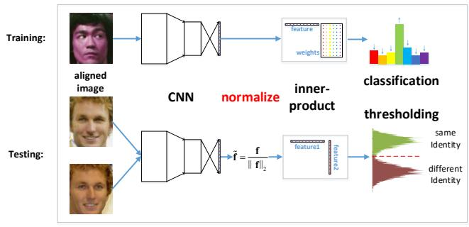  
Figure 1: Pipeline of face verication model training and testing using a classication loss function. Previous works did not use the normalization after feature extraction during training. But in the testing phase, all methods used a normalized similarity, e.g. cosine, to compare two features.

Some previous works[23, 28] successfully trained CNN models with the features being normalized in an end-to-end fashion. However, both of them used the triplet loss, which needs to sample triplets of face images during training. It is dicult to train because we usually need to implement hard mining algorithms to nd non-trivial triplets[28]. Another route is to train a classication network using softmax loss[31, 38] and regularizations to limit the intra-class variance[16, 36]. Furthermore, some works combine the classication and metric learning loss functions together to train CNN models[31, 41]. All these methods that used classication loss functions, e.g. softmax loss, did not apply feature normalization, even though they all used normalized similarity measure, e.g. cosine similarity, to get the condence of judging two samples being of the same identity at testing phase(Figure 1).

We did an experiment by normalizing both the features and the weights of the last inner-product layer to build a cosine layer in an ordinary CNN model. After sucient iterations, the network still did not converge. After observing this phenomenon, we deeply dig into this problem. In this paper, we will nd out the reason and propose methods to enable us to train the normalized features.

To sum up, in this work, we analyze and answer the questions mentioned above about the feature normalization and the model training:

(1) Why is feature normalization so ecient when comparing the CNN features trained by classication loss, especially for softmax loss?   
(2) Why does directly optimizing the cosine similarity using softmax loss cause the network to fail to converge?   
(3) How to optimize a cosine similarity when using softmax loss?   
(4) Since models with softmax loss fail to converge after normalization, are there any other loss functions suitable for normalized features?

For the rst question, we explain it through a property of softmax loss in Section 3.1. For the second and third questions, we provide a bound to describe the diculty of using softmax loss to optimize a cosine similarity and propose using the scaled cosine similarity in Section 3.3. For the fourth question, we reformulate a set of loss functions in metric learning, such as contrastive loss and triplet loss to perform the classication task by introducing an ‘agent’

strategy (Section 4). Utilizing the ‘agent’ strategy, there is no need to sample pairs and triplets of samples nor to implement the hard mining algorithm.

We also propose two tricks to improve performance for both static and video face verication. The rst is to merge features extracted from both original image and mirror image by summation, while previous works usually merge the features by concatenation[31, 36]. The second is to use histogram of face similarities between video pairs instead of the mean[23, 36] or max[39] similarity when making classication.

Finally, by experiments, we show that normalization during training can promote the accuracies of two publicly available stateof-the-art models by $0 . 2 \sim 0 . 4 \%$ on LFW[10] and about $0 . 6 \%$ on YTF[37].

# 2 RELATED WORKS

Normalization in Neural Network. Normalization is a common operation in modern neural network models. Local Response Normalization and Local Contrast Normalization are studied in the AlexNet model[12], even though these techniques are no longer common in modern models. Batch normalization[11] is widely used to accelerate the speed of neural network convergence by reducing the internal covariate shift of intermediate features. Weight normalization [27] was proposed to normalize the weights of convolution layers and inner-product layers, and also lead to faster convergence speed. Layer normalization [1] tried to solve the batch size dependent problem of batch normalization, and works well on Recurrent Neural Networks.

Face Verication. Face verication is to decide whether two images containing faces represent the same person or two dierent people, and thus is important for access control or re-identication tasks. Face verication using deep learning techniques achieved a series of breakthroughs in recent years [20, 23, 28, 33, 36]. There are mainly two types of methods according to their loss functions. One type uses metric learning loss functions, such as contrastive loss[4, 40] and triplet loss[23, 28, 34]. The other type uses softmax loss and treats the problem as a classication task, but also constrains the intra-class variance to get better generalization for comparing face features [16, 36]. Some works also combine both kinds of loss functions[40, 41].

Metric Learning. Metric learning[4, 25, 34] tries to learn semantic distance measures and embeddings such that similar samples are nearer and dierent samples are further apart from each other on a manifold. With the help of neural networks’ enormous ability of representation learning, deep metric learning[3, 19] can do even better than the traditional methods. Recently, more complicated loss functions were proposed to get better local embedding structures[8, 22, 30].

Recent Works on Normalization. Recently, cosine similarity [17] was used instead of the inner-product for training a CNN for person recognition, which is quite similar with face verication. The Cosine Loss proposed in [17] is quite similar with the one described in Section 3.3, normalizing both the features and weights. L2-softmax[24] shares a similar analysis about the convergence problem described in Section 3.3. In [24], the authors also propose to add a scale parameter after normalization, but they only normalize the features. SphereFace[35] improves the performance of Large

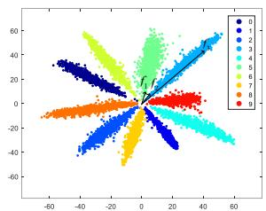

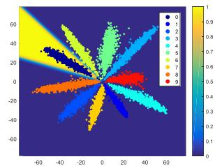  
Figure 2: Le: The optimized 2-dimensional feature distribution using softmax loss on MNIST[14] dataset. Note that the Euclidean distance between $\mathbf { f } _ { 1 }$ and $\mathbf { f } _ { 2 }$ is much smaller than the distance between f2 and f3, even though f2 and f3 are from the same class. Right: The softmax probability for class 0 on the 2-dimension plane. Best viewed in color.

Margin Softmax[16] by normalizing the weights of the last innerproduct layer only. Von Mises-Fisher Mixture Model(vMFMM)[21] interprets the hypersphere embedding as a mixture of von Mises-Fisher distributions. To sum up, the Cosine Loss[17], vMFMM[21] and our proposed loss functions optimize both features and weights, while the L2-softmax[24] normalizes the features only and the SphereFace[35] normalizes the weights only.

# 3 $L _ { 2 }$ NORMALIZATION LAYER

In this section, we answer the question why we should normalize the features when the loss function is softmax loss and why the network does not converge if we directly put a softmax loss on the normalized features.

# 3.1 Necessity of Normalization

In order to give an intuitive feeling about the softmax loss, we did a toy experiment of training a deeper LeNet[13] model on the MNIST dataset[14]. We reduced the number of the feature dimension to 2 and plot 10,000 2-dimensional features from the training set on a plane in Figure 2. From the gure, we nd that f2 can be much closer to f1 than to $\mathbf { f } _ { 3 }$ if we use Euclidean distance as the metric. Hence directly using the features for comparison may lead to bad performance. At the same time, we nd that the angles between feature vectors seem to be a good metric compared with Euclidean distance or inner-product operations. Actually, most previous work takes the cosine of the angle between feature vectors as the similarity [31, 36, 38], even though they all use softmax loss to train the network. Since the most common similarity metric for softmax loss is the inner-product with unnormalized features, there is a gap between the metrics used in the training and testing phases.

The reason why the softmax loss tends to create a ‘radial’ feature distribution (Figure 2) is that the softmax loss actually acts as the soft version of max operator. Scaling the feature vectors’ magnitude does not aect the assignment of its class. Formally speaking, we recall the denition of the softmax loss,

$$
\mathcal {L} _ {S} = - \frac {1}{m} \sum_ {i = 1} ^ {m} \log \frac {e ^ {W _ {y _ {i}} ^ {T} \mathbf {f} _ {i} + b _ {y _ {i}}}}{\sum_ {j = 1} ^ {n} e ^ {W _ {j} ^ {T} \mathbf {f} _ {i} + b _ {j}}}, \tag {1}
$$

where $m$ is the number of training samples, $n$ is the number of classes, $\mathbf { f } _ { i }$ is the feature of the -th sample, $y _ { i }$ nis the corresponding

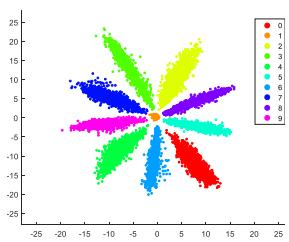

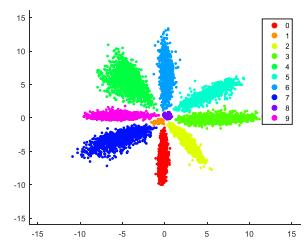  
Figure 3: Two selected scatter diagrams when bias term is added after inner-product operation. Please note that there are one or two clusters that are located near the zero point. If we normalize the features of the center clusters, they would spread everywhere on the unit circle, which would cause misclassication. Best viewed in color.

label in range $[ 1 , n ]$ ,  and $^ { b }$ are the weight matrix and the bias , n W bvector of the last inner-product layer before the softmax loss, $W _ { j }$ is the $j$ -th column of  , which is corresponding to the $j$ j-th class. In j Wthe testing phase, we classify a sample by

$$
C l a s s (\mathbf {f}) = i = \arg \max  _ {i} \left(W _ {i} ^ {T} \mathbf {f} + b _ {i}\right). \tag {2}
$$

In this case, we can infer that $( W _ { i } \mathbf { f } + b _ { i } ) - ( W _ { j } \mathbf { f } + b _ { j } ) \geq 0 , \forall j \in [ 1 , n ]$ Wi bi Wj bj , jUsing this inequality, we obtain the following proposition.

Proposition 1. For the softmax loss with no-bias inner-product similarity as its metric, let $\begin{array} { r } { P _ { i } ( \mathbf { f } ) = \frac { e ^ { W _ { i } ^ { T } \mathbf { f } } } { \sum _ { j = 1 } ^ { n } e ^ { W _ { j } ^ { T } \mathbf { f } } } } \end{array}$ W T f e denote the probability of $\mathbf { x }$ jbeing classied as class . For any given scale $s \ > \ 1$ , $i f i =$ $\operatorname { a r g m a x } _ { j } \left( W _ { j } ^ { T } \mathbf { f } \right)$ , then $P _ { i } ( s \mathbf { f } ) \geq P _ { i } ( \mathbf { f } )$ always holds.

The proof is given in Appendix 8.1. This proposition implies that softmax loss always encourages well-separated features to have bigger magnitudes. This is the reason why the feature distribution of softmax is ‘radial’. However, we may not need this property as shown in Figure2. By normalization, we can eliminate its eect. Thus, we usually use the cosine of two feature vectors to measure the similarity of two samples.

However, Proposition 1 does not hold if a bias term is added after the inner-product operation. In fact, the weight vector of the two classes could be the same and the model still could make a decision via the biases. We found this kind of case during the MNIST experiments and the scatters are shown in Figure 3. It can be discovered from the gure that the points of some classes all locate around the zero point, and after normalization the points from each of these classes may be spread out on the unit circle, overlapping with other classes. In these cases, feature normalization may destroy the discrimination ability of the specic classes. To avoid this kind of risk, we do not add the bias term before the softmax loss in this work, even though it is commonly used for classication tasks.

# 3.2 Layer Denition

In this paper, we dene $\| \mathbf { x } \| _ { 2 } = \sqrt { \sum _ { i } \mathbf { x } _ { i } ^ { 2 } + \epsilon }$ , where $\epsilon$ is a small i ipositive value to prevent dividing zero. For an input vector $\mathbf { x } \in \mathcal { R } ^ { n }$ ,

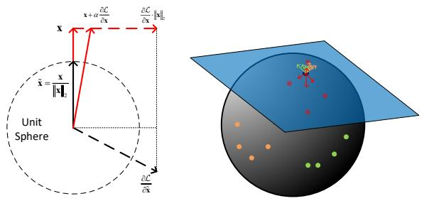  
Figure 4: Le: The normalization operation and its gradient in 2-dimensional space. Please note that $\| \mathbf { x } + \alpha \frac { \partial \mathcal { L } } { \partial \mathbf { x } } \|$ is always bigger than $\| \mathbf { x } \|$ for all $\alpha > 0$ α ∂ because of the Pythagoras theα >orem. Right: An example of the gradients w.r.t. the weight vector. All the gradients are in the tangent space of the unit sphere (denoted as the blue plane). The red, yellow and green points are normalized features from 3 dierent classes. The blue point is the normalized weight corresponding to the red class. Here we assume that the model tries to make features get close to their corresponding classes and away from other classes. Even though we illustrate the gradients applied on the normalized weight only, please note that opposite gradients are also applied on the normalized features (red, yellow, green points). Finally, all the gradients are accumulated together to decide which direction the weight should be updated. Best viewed in color, zoomed in.

an $L _ { 2 }$ normalization layer outputs the normalized vector,

$$
\tilde {\mathbf {x}} = \frac {\mathbf {x}}{\| \mathbf {x} \| _ {2}} = \frac {\mathbf {x}}{\sqrt {\sum_ {i} \mathbf {x} _ {i} ^ {2} + \epsilon}}. \tag {3}
$$

Here $\mathbf { x }$ can be either the feature vector f or one column of the weight matrix $W _ { i }$ . In backward propagation, the gradient w.r.t. x Wican be obtained by the chain-rule,

$$
\begin{array}{l} \frac {\partial \mathcal {L}}{\partial \mathbf {x} _ {i}} = \frac {\partial \mathcal {L}}{\partial \tilde {\mathbf {x}} _ {i}} \frac {\partial \tilde {\mathbf {x}} _ {i}}{\partial \mathbf {x} _ {i}} + \sum_ {j} \frac {\partial \mathcal {L}}{\partial \tilde {\mathbf {x}} _ {j}} \frac {\partial \tilde {\mathbf {x}} _ {j}}{\partial \| \mathbf {x} \| _ {2}} \frac {\partial \| \mathbf {x} \| _ {2}}{\partial \mathbf {x} _ {i}} \\ = \frac {\frac {\partial \underline {{f}}}{\partial \bar {\mathbf {x}} _ {i}} - \tilde {\mathbf {x}} _ {i} \sum_ {j} \frac {\partial \underline {{f}}}{\partial \bar {\mathbf {x}} _ {j}} \tilde {\mathbf {x}} _ {j}}{\| \mathbf {x} \| _ {2}}. \tag {4} \\ \end{array}
$$

It is noteworthy that vector $\mathbf { x }$ and $\begin{array} { r } { \frac { { \partial { \mathcal { L } } } } { { \partial { \bf x } } } } \end{array}$ are orthogonal with each other, i.e. $\begin{array} { r } { \langle \mathbf { x } , \frac { \partial \mathcal { L } } { \partial \mathbf { x } } \rangle = 0 } \end{array}$ ∂ x ∂. From a geometric perspective, the gradient $\begin{array} { r } { \frac { { \partial { \mathcal { L } } } } { { \partial { \bf x } } } } \end{array}$ , ∂ is the projection of $\frac { \partial \mathcal { L } } { \partial \tilde { \mathbf { x } } }$ onto the tangent space of the unit ∂ ∂hypersphere at normal vector $\tilde { \mathbf { x } }$ (see Figure 4). From Figure 4 left, it can be inferred that after update, $\| \mathbf { x } \| _ { 2 }$ always increases. In order to prevent $\| \mathbf { x } \| _ { 2 }$ growing innitely, weight decay is necessary on vector $\mathbf { x }$ .

# 3.3 Reformulating Softmax Loss

Using the normalization layer, we can directly optimize the cosine similarity,

$$
d \left(\mathbf {f}, \mathbf {W} _ {\mathbf {i}}\right) = \frac {\langle \mathbf {f} , \mathbf {W} _ {\mathbf {i}} \rangle}{\| \mathbf {f} \| _ {2} \| \mathbf {W} _ {\mathbf {i}} \| _ {2}}, \tag {5}
$$

where f is the feature and $\mathbf { W _ { i } }$ represents the $i \cdot$ -th column of the iweight matrix of the inner-product layer before softmax loss layer.

However, after normalization, the network fails to converge. The loss only decreases a little and then converges to a very big value within a few thousands of iterations. After that the loss does not decrease no matter how many iterations we train and how small the learning rate is.

This is mainly because the range of $d ( \mathbf { f } , \mathbf { W _ { i } } )$ is only $[ - 1 , 1 ]$ after d ,normalization, while it is usually between $\left( - 2 0 , 2 0 \right)$ and $\left( - 8 0 , 8 0 \right)$ when we use an inner-product layer and softmax loss. This low range problem may prevent the probability $\begin{array} { r } { P _ { \boldsymbol { y _ { i } } } ( \mathbf { f } ; \mathbf { W } ) = \frac { e ^ { \mathbf { W } _ { \mathbf { y _ { i } } } ^ { \mathrm { T } } \mathbf { f } } } { \sum _ { j } ^ { n } e ^ { \mathbf { W _ { j } ^ { \mathrm { T } } f } } } } \end{array}$ , where $y _ { i }$ jis f’s label, from getting close to 1 even when the samples yiare well-separated. In the extreme case, $\frac { e ^ { 1 } } { e ^ { 1 } + ( n - 1 ) e ^ { - 1 } }$ is very small (0 45 when $n = 1 0$ ; 0 007 when $n = 1 0 0 0 \mathrm { \ : }$ n e), even though in this . n . ncondition the samples of all other classes are on the other side of the unit hypersphere. Since the gradient of softmax loss w.r.t. the ground truth label is $1 - P _ { y _ { i } }$ , the model will always try to give large Pyigradients to the well separated samples, while the harder samples may not get sucient gradients.

To better understand this problem, we give a bound to clarify how small the softmax loss can be in the best case.

Proposition 2. (Softmax Loss Bound After Normalization) Assume that every class has the same number of samples, and all the samples are well-separated, i.e. each sample’s feature is exactly same with its corresponding class’s weight. If we normalize both the features and every column of the weights to have a norm of $\ell$ , the softmax loss will have a lower bound, $\log \left( 1 + \left( n - 1 \right) e ^ { - { \frac { n } { n - 1 } } \ell ^ { 2 } } \right)$ , where  is the class number.

The proof is given in Appendix 8.2. Even though reading the proof need patience, we still encourage readers to read it because you may get better understanding about the hypersphere manifold from it.

This bound implies that if we just normalize the features and weights to 1, the softmax loss will be trapped at a very high value on training set, even if no regularization is applied. For a real example, if we train the model on the CASIA-Webface dataset $( n = 1 0 5 7 5 )$ ), nthe loss will decrease from about 9 27 to about 8 50. The bound for . .this condition is 8 27, which is very close to the real value. This .suggests that our bound is very tight. To give an intuition for the bound, we also plot the curve of the bound as a function of the norm $\ell$ in Figure 5.

`After we obtain the bound, the solution to the convergence problem is clear. By normalizing the features and columns of weight to a bigger value $\ell$ instead of 1, the softmax loss can continue to `decrease. In practice, we may implement this by directly appending a scale layer after the cosine layer. The scale layer has only one learnable parameter $s = \ell ^ { 2 }$ . We may also x it to a value that is large enough referring to Figure 5, say 20 or 30 for dierent class number. However, we prefer to make the parameter automatically learned by back-propagation instead of introducing a new hyper-parameter for elegance. Finally, the softmax loss with cosine distance is dened as

$$
\mathcal {L} _ {\mathcal {S},} = - \frac {1}{m} \sum_ {i = 1} ^ {m} \log \frac {e ^ {s \bar {W} _ {y _ {i}} ^ {T} \bar {\mathbf {f}} _ {i}}}{\sum_ {j = 1} ^ {n} e ^ {s \bar {W} _ {j} ^ {T} \bar {\mathbf {f}} _ {i}}}, \tag {6}
$$

where $\tilde { \mathbf { x } }$ is the normalized x.

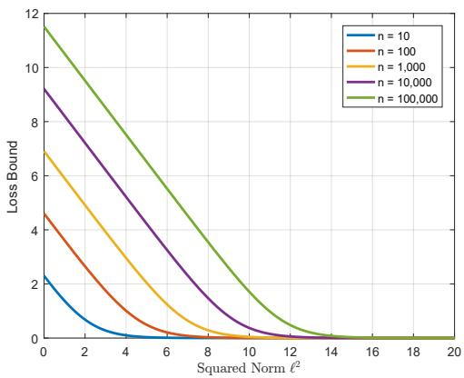  
Figure 5: The softmax loss’ lower bound as a function of features and weights’ norm. Note that the $x$ axis is the squared norm $\ell ^ { 2 }$ xbecause we add the scale parameter directly on the `cosine distance in practice.

# 4 REFORMULATING METRIC LEARNING

Metric Learning, or specically deep metric learning in this work, usually takes pairs or triplets of samples as input, and outputs the distance between them. In deep metric models, it is a common strategy to normalize the nal features[22, 23, 28]. It seems that normalization does not cause any problems for metric learning loss functions. However, metric learning is more dicult to train than classication because the possible input pairs or triplets in metric learning models are very large, namely $O ( N ^ { 2 } )$ combinations for pairs and $O ( N ^ { 3 } )$ Ncombinations for triplets, where $N$ is the amount N Nof training samples. It is almost impossible to deal with all possible combinations during training, so sampling and hard mining algorithms are usually necessary[28], which are tricky and timeconsuming. By contrast, in a classication task, we usually feed the data iteratively into the model, namely the input data is in order of $O ( N )$ . In this section, we attempt to reformulate some metric Nlearning loss functions to do the classication task, while keeping their compatibility with the normalized features.

The most widely used metric learning methods in the face veri- cation community are the contrastive loss[31, 40],

$$
\mathcal {L} _ {C} = \left\{ \begin{array}{l l} \| \tilde {\mathbf {f}} _ {i} - \tilde {\mathbf {f}} _ {j} \| _ {2} ^ {2}, & c _ {i} = c _ {j} \\ \max (0, m - \| \tilde {\mathbf {f}} _ {i} - \tilde {\mathbf {f}} _ {j} \| _ {2} ^ {2}), & c _ {i} \neq c _ {j} \end{array} \right., \tag {7}
$$

and the triplet loss[23, 28],

$$
\mathcal {L} _ {\mathcal {T}} = \max  (0, m + \| \tilde {\mathbf {f}} _ {i} - \tilde {\mathbf {f}} _ {j} \| _ {2} ^ {2} - \| \tilde {\mathbf {f}} _ {i} - \tilde {\mathbf {f}} _ {k} \| _ {2} ^ {2}), \quad c _ {i} = c _ {j}, c _ {i} \neq c _ {k}, \tag {8}
$$

where the two $m$ ’s are the margins. Both of the two loss functions moptimize the normalized Euclidean distance between feature pairs. Note that after normalization, the reformulated softmax loss can

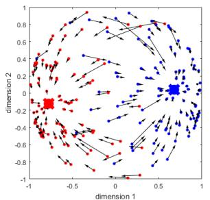  
: feature   
: agent

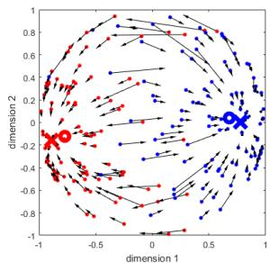  
: class center   
: gradient   
Figure 6: Illustration of how the C-contrastive loss works with two classes on a 3-d sphere (projected on a 2-d plane). Le: The special case of $ { m } =  { 0 }$ . In this case, the agents are only inuenced by features from their own classes. The agents will nally converge to the centers of their corresponding classes. Right: Normal case of $m = 1$ . In this case, mthe agents are inuenced by all the features in the same classes and other classes’ features in the margin. Hence the agents are shifted away from the boundary of the two classes. The features will follow their agents through the intra-class term $\| \tilde { \mathbf { f } } _ { i } - \tilde { W } _ { j } \| _ { 2 } ^ { 2 } , c _ { i } = j$ as the gradients shown in i Wj , cithe gure. Best viewed in color.

also be seen as optimizing the normalized Euclidean distance,

$$
\begin{array}{l} \mathcal {L} _ {\mathcal {S},} = - \frac {1}{m} \sum_ {i = 1} ^ {m} l o g \frac {e ^ {s \tilde {W} _ {y _ {i}} ^ {T} \tilde {\mathbf {f}} _ {i}}}{\sum_ {j = 1} ^ {n} e ^ {s \tilde {W} _ {j} ^ {T} \tilde {\mathbf {f}} _ {i}}} \\ = - \frac {1}{m} \sum_ {i = 1} ^ {m} l o g \frac {e ^ {- \frac {s}{2} \| \tilde {\mathbf {f}} _ {i} - \tilde {W} _ {y _ {i}} \| _ {2} ^ {2}}}{\sum_ {j = 1} ^ {n} e ^ {- \frac {s}{2} \| \tilde {\mathbf {f}} _ {i} - \tilde {W} _ {j} \| _ {2} ^ {2}}}, \\ \end{array}
$$

because $\| \tilde { \mathbf { x } } - \tilde { \mathbf { y } } \| _ { 2 } ^ { 2 } = 2 - 2 \tilde { \mathbf { x } } ^ { T } \tilde { \mathbf { y } }$ . Inspired by this formulation, we modify one of the features to be one column of a weight matrix $W \in \mathbb { R } ^ { d \times n }$ , where $d$ is the dimension of the feature and $n$ is the W dclass number. We call column $W _ { i }$ nas the ‘agent’ of the -th class. Wi iThe weight matrix can be learned through back-propagation just as the inner-product layer. In this way, we can get a classication version of the contrastive loss,

$$
\mathcal {L} _ {\mathcal {C},} = \left\{ \begin{array}{l l} \| \tilde {\mathbf {f}} _ {i} - \tilde {W} _ {j} \| _ {2} ^ {2}, & c _ {i} = j \\ \max  (0, m - \| \tilde {\mathbf {f}} _ {i} - \tilde {W} _ {j} \| _ {2} ^ {2}), & c _ {i} \neq j \end{array} , \right. \tag {10}
$$

and the triplet loss,

$$
\mathcal {L} _ {\mathcal {T} ^ {\prime}} = \max  (0, m + \| \tilde {\mathbf {f}} _ {i} - \tilde {W} _ {j} \| _ {2} ^ {2} - \| \tilde {\mathbf {f}} _ {i} - \tilde {W} _ {k} \| _ {2} ^ {2}), \quad c _ {i} = j, c _ {i} \neq k. \tag {11}
$$

To distinguish these two loss functions from their metric learning versions, we call them $C$ -contrastive loss and $C \mathrm { \cdot }$ -triplet loss respectively, denoting that these loss functions are designed for classication.

Intuitively, $W _ { j }$ acts as a summarizer of the features in $j \cdot$ -th class. WjIf all classes are well-separated by the margin, the $W _ { j }$ j’s will roughly jcorrespond to the means of features in each class (Figure 6 left). In more complicated tasks, features of dierent classes may be overlapped with each other. Then the $W _ { j }$ ’s will be shifted away Wjfrom the boundaries. The marginal features (hard examples) are

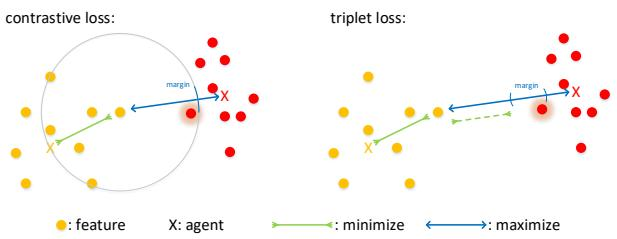  
Figure 7: Classication version of contrastive loss (Left) and triplet loss (Right). The shadowed points are the marginal features that got omitted due to the ‘agent’ strategy. In the original version of the two losses, the shadowed points are also optimized. Best viewed in color.

guided to have bigger gradients in this case (Figure 6 right), which means they move further than easier samples during update.

However, there are some side eect of the agent strategy. After reformulation, some of the marginal features may not be optimized if we still use the same margin as the original version (Figure 7). Thus, we need larger margins to make more features get optimized. Mathematically, the error caused by the agent approximation is given by the following proposition.

Proposition 3. Using an agent for each class instead of a specic sample would cause a distortion of $\begin{array} { r } { \frac { 1 } { n _ { C _ { i } } } \sum _ { j \in C _ { i } } \big ( d ( f _ { 0 } , f _ { j } ) - d ( f _ { 0 } , W _ { i } ) \big ) ^ { 2 } } \end{array}$ , where $W _ { i }$ n i j iis the agent of the th-class. The distortion is bounded by $\begin{array} { r } { \frac { 1 } { n _ { C _ { i } } } \sum _ { j \in C _ { i } } d ( f _ { j } , W _ { i } ) ^ { 2 } } \end{array}$ .

The proof is given in Appendix 8.3. This bound gives us a theoretical guidance of setting the margins. We can compute it on-the-y feelings about the progress. Empirically, the bound 1C during training using moving-average and display it to get better $\begin{array} { r } { \frac { 1 } { n _ { C _ { i } } } \sum _ { j \in C _ { i } } d ( f _ { j } , W _ { i } ) ^ { 2 } } \end{array}$ is usually $0 . 5 \sim 0 . 6$ n i j i. The recommendation value of the margins of . .the modied contrastive loss and triplet loss is 1 and 0 8 respectively.

Note that setting the margin used to be complicated work[40]. Following their work, we have to suspend training and search for a new margin for every several epochs. However, we no longer need to perform such a searching algorithm after applying normalization. Through normalization, the scale of features’ magnitude is xed, which makes it possible to x the margin, too. In this strategy, we will not try to train models using the C-contrastive loss or the C-triplet loss without normalization because this is dicult.

# 5 EXPERIMENT

In this section, we rst describe the experiment settings in Section 5.1. Then we evaluate our method on two dierent datasets with two dierent models in Section 5.2 and 5.3. Codes and models are released at https://github.com/happynear/NormFace.

# 5.1 Implementation Details

Baseline works. To verify our algorithm’s universality, we choose two works as our baseline, Wu et. al.’s model [38]2 (Wu’s model,

for short) and Wen et. al.’s model $[ 3 6 ] ^ { 3 }$ (Wen’s model, for short). Wu’s model is a 10-layer plain CNN with Maxout[6] activation unit. Wen’s model is a 28-layer ResNet[7] trained with both softmax loss and center loss. Neither of these two models apply feature normalization or weight normalization. We strictly follow all the experimental settings as their papers, including the datasets4, the image resolution, the pre-processing methods and the evaluation criteria.

Training. The proposed loss functions are appended after the feature layer, i.e. the second last inner-product layer. The features and columns of weight matrix are normalized to make their $L _ { 2 }$ norm Lto be 1. Then the features and columns of the weight matrix are sent into a pairwise distance layer, i.e. inner-product layer to produce a cosine similarity or Euclidean distance layer to produce a normalized Euclidean distance. After calculating all the similarities or distances between each feature and each column, the proposed loss functions will give the nal loss and gradients to the distances. The whole network models are trained end to end. To speed up the training procedure, we ne-tune the networks from the baseline models. Thus, a relatively small learning rate, say 1e-4 for Wu’s model and 1e-3 for Wen’s model, are applied to update the network through stochastic gradient descent (SGD) with momentum of 0 9. Evaluation. Two datasets are utilized to evaluate the performance, one is Labeled Face in the Wild (LFW)[10] and another is Youtube Face (YTF)[37]. 10-fold validation is used to evaluate the performance for both datasets. After the training models converge, we continue to train them for 5 000 iterations5, during which we save ,a snapshot for every 1 000 iterations. Then we run the evaluation ,codes on the ve saved snapshots separately and calculate an average score to reduce disturbance. We extract features from both the frontal face and its mirror image and merge the two features by element-wise summation. Principle Component Analysis (PCA) is then applied on the training subset of the evaluation dataset to t the features to the target domain. Similarity score is computed by the cosine distance of two sample’s features after PCA. All the evaluations are based on the similarity scores of image pairs.

# 5.2 Experiments on LFW

The LFW dataset[10] contains 13 233 images from 5 749 identi-, ,ties, with large variations in pose, expression and illumination. All the images are collected from Internet. We evaluate our methods through two dierent protocols on LFW, one is the standard unrestricted with labeled outside data [9], which is evaluated on 6 000 ,image pairs, and another is BLUFR [15] which utilize all 13 233 images. It is noteworthy that there are three same identities in CASIA-Webface[40] and LFW[10]. We delete them during training to build a complete open-set validation.

We carefully test almost all combinations of the loss functions on the standard unrestricted with labeled outside data protocol. The results are listed in Table 2. Cosine similarity is used by softmax $^ +$ any loss functions. The distance used by $C$ -contrastive and $C$ -triplet loss is the squared normalized Euclidean distance. The $C \mathrm { \cdot }$ -triplet

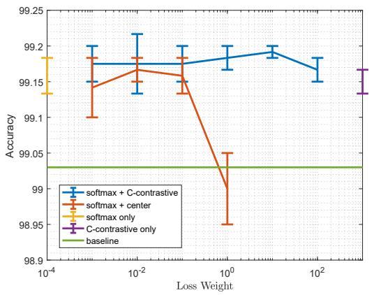  
Figure 8: LFW accuracies as a function of the loss weight of C-contrastive loss or center loss with error bars. All these methods use the normalization strategy except for the baseline.

Table 2: Results on LFW 6,000 pairs using Wen’s model[36]   

<table><tr><td>loss function</td><td>Normalization</td><td>Accuracy</td></tr><tr><td>softmax</td><td>No</td><td>98.28%</td></tr><tr><td>softmax + dropout</td><td>No</td><td>98.35%</td></tr><tr><td>softmax + center[36]</td><td>No</td><td>99.03%</td></tr><tr><td>softmax</td><td>feature only</td><td>98.72%</td></tr><tr><td>softmax</td><td>weight only</td><td>98.95%</td></tr><tr><td>softmax</td><td>Yes</td><td>99.16% ± 0.025%</td></tr><tr><td>softmax + center</td><td>Yes</td><td>99.17% ± 0.017%</td></tr><tr><td>C-contrasitve</td><td>Yes</td><td>99.15% ± 0.017%</td></tr><tr><td>C-triplet</td><td>Yes</td><td>99.11% ± 0.008%</td></tr><tr><td>C-triplet + center</td><td>Yes</td><td>99.13% ± 0.017%</td></tr><tr><td>softmax + C-contrastive</td><td>Yes</td><td>99.19% ± 0.008%</td></tr></table>

$^ +$ center loss is implemented by forcing to optimize $\| \mathbf { x } _ { i } - W _ { j } \| _ { 2 } ^ { 2 }$ even if $m + \| \mathbf { x } _ { i } - W _ { j } \| _ { 2 } ^ { 2 } - \| \mathbf { x } _ { i } - W _ { k } \| _ { 2 } ^ { 2 }$ i Wjis less than 0. From Table 2 m i Wj i Wkwe can conclude that the loss functions have minor inuence on the accuracy, and the normalization is the key factor to promote the performance. When combining the softmax loss with the Ccontrastive loss or center loss, we need to add a hyper-parameter to make balance between the two losses. The highest accuracy, $9 9 . 2 1 6 7 \%$ , is obtained by softmax $+ \ 0 . 0 1 * \mathrm { C }$ -contrastive. However, pure softmax with normalization already works reasonably well.

We have also designed two ablation experiments of normalizing the features only or normalizing the columns of weight matrix only. During experiments we nd that the scale parameter is necessary when normalizing the feature, while normalizing the weight does not need it. We cannot explain it so far. This is tricky but the network will collapse if the scale parameter is not properly added. From Table 2 we can conclude that normalizing the feature causes performance degradation, while normalizing the weight has little inuence on the accuracy. Note that these two special cases of softmax loss are also ne-tuned based on Wen’s model. When training from scratch,

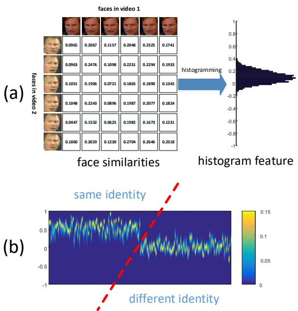  
Figure 9: (a): Illustration of how to generate a histogram feature for a pair of videos. We rstly create a pairwise score matrix by computing the cosine similarity between two face images from dierent video sequences. Then we accumulate all the scores in the matrix to create a histogram. (b): Visualization of histogram features extracted from 200 video pairs with both same identities and dierent identities. After collecting all histogram features, support vector machine (SVM) using histogram intersection kernel(HIK) is utilized to make a binary classication.

normalizing the weights only will cause the network collapse, while normalizing the features only will lead to a worse accuracy, $9 8 . 4 5 \%$ .which is better than the conventional softmax loss, but much worse than state-of-the-art loss functions.

In Figure 8, we show the eect of the loss weights when using two loss functions. As shown in the gure, the C-contrastive loss is more robust to the loss weight. This is not surprising because Ccontrastive loss can train a model by itself only, while the center loss, which only optimizes the intra-class variance, should be trained with other supervised losses together.

To make our experiment more convincing, we also train some of the loss functions on Wu’s model[38]. The results are listed in Table 4. Note that in [38], Wu et. al. did not perform face mirroring when they evaluated their methods. In Table 4, we also present the result of their model after face mirroring and feature merging. As is shown in the table, the normalization operation still gives a signicant boost to the performance.

On BLUFR protocol, the normalization technique works even better. Here we only compare some of the models with the baseline (Table 3). From Table 3 we can see that normalization could boost the performance signicantly, which reveals that normalization technique could perform much better when the false alarm rate (FAR) is low.

Table 3: Results on LFW BLUFR[15] protocol   

<table><tr><td>model</td><td>loss function</td><td>Normalization</td><td>TPR@FAR=0.1%</td><td>DIR@FAR=1%</td></tr><tr><td>ResNet</td><td>softmax + center[36]</td><td>No</td><td>93.35%</td><td>67.86%</td></tr><tr><td>ResNet</td><td>softmax</td><td>Yes</td><td>95.77%</td><td>73.92%</td></tr><tr><td>ResNet</td><td>C-triplet + center</td><td>Yes</td><td>95.73%</td><td>76.12%</td></tr><tr><td>ResNet</td><td>softmax + C-contrastive</td><td>Yes</td><td>95.83%</td><td>77.18%</td></tr><tr><td>MaxOut</td><td>softmax[38]</td><td>No</td><td>89.12%</td><td>61.79%</td></tr><tr><td>MaxOut</td><td>softmax</td><td>Yes</td><td>90.64%</td><td>65.22%</td></tr><tr><td>MaxOut</td><td>C-contrastive</td><td>Yes</td><td>90.32%</td><td>68.14%</td></tr></table>

Table 4: Results on LFW 6,000 pairs using Wu’s model[38]   

<table><tr><td>loss function</td><td>Normalization</td><td>Accuracy</td></tr><tr><td>softmax</td><td>No</td><td>98.13%</td></tr><tr><td>softmax + mirror</td><td>No</td><td>98.41%</td></tr><tr><td>softmax</td><td>Yes</td><td>98.75% ± 0.008%</td></tr><tr><td>C-contrastive</td><td>Yes</td><td>98.78% ± 0.017%</td></tr><tr><td>softmax + C-contrastive</td><td>Yes</td><td>98.71% ± 0.017%</td></tr></table>

Table 5: Results on YTF with Wen’s model[36]   

<table><tr><td>loss function</td><td>Normalization</td><td>Accuracy</td></tr><tr><td>softmax + center[36]</td><td>No</td><td>93.74%</td></tr><tr><td>softmax</td><td>Yes</td><td>94.24%</td></tr><tr><td>softmax + HIK-SVM</td><td>Yes</td><td>94.56%</td></tr><tr><td>C-triplet + center</td><td>Yes</td><td>94.3%</td></tr><tr><td>C-triplet + center + HIK-SVM</td><td>Yes</td><td>94.58%</td></tr><tr><td>softmax + C-contrastive</td><td>Yes</td><td>94.34%</td></tr><tr><td>softmax + C-contrastive + HIK-SVM</td><td>Yes</td><td>94.72%</td></tr></table>

# 5.3 Experiments on YTF

The YTF dataset[37] consists of 3,425 videos of 1,595 dierent people, with an average of 2.15 videos per person. We follow the unrestricted with labeled outside data protocol, which takes 5 000 video pairs to evaluate the performance.

Previous works usually extract face features from all frames or some selected frames in a video. Then two videos can construct a condence matrix $C$ in which each element $C _ { i j }$ is the cosine distance ijof face features extracted from the -th frame of the rst video and $j \cdot$ i-th frame of the second video. The nal score is computed by the javerage of all all elements in . The one dimension score is then Cused to train a classier, say SVM, to get the threshold of same identity or dierent identity.

Here we propose to use the histogram of elements in $C$ as the Cfeature to train the classier. The bin of the histogram is set to 100 (Figure 9(a)). Then SVM with histogram intersection kernel (HIK-SVM)[2] is utilized to make a two-class classication (Figure 9(b)). This method encodes more information compared to the one dimensional mean value, and leads to better performance on video face verication.

The results are listed in Table 5. The models that perform better on LFW also show superior performance on YTF. Moreover, the newly proposed score histogram technique (HIK-SVM in the table) can improve the accuracy further by a signicant gap.

# 6 CONCLUSION AND FUTURE WORK

In this paper, we propose to apply $L _ { 2 }$ normalization operation on Lthe features and the weight of the last inner-product layer when training a classication model. We explain the necessity of the normalization operation from both analytic and geometric perspective. Two kinds of loss functions are proposed to eectively train the normalized feature. One is a reformulated softmax loss with a scale layer inserted between the cosine score and the loss. Another is designed inspired by metric learning. We introduce an agent strategy to avoid the need of hard sample mining, which is a tricky and time-consuming work. Experiments on two dierent models both show superior performance over models without normalization. From three theoretical propositions, we also provide some guidance on the hyper-parameter setting, such as the bias term (Proposition 1), the scale parameter (Proposition 2) and the margin (Proposition 3).

Currently we can only ne-tune the network with normalization techniques based on other models. If we train a model with Ccontrastive loss function, the nal result is just as good as center loss[36]. But if we ne-tune a model, either Wen’s model[36] or Wu’s model[38], the performance could be further improved as shown in Table 2 and Table 4. More eorts are needed to nd a way to train a model from scratch, while preserving at least a similar performance as ne-tuning.

Our methods and analysis in this paper are general. They can be used in other metric learning tasks, such as person re-identication or image retrieval. We will apply the proposed methods on these tasks in the future.

# 7 ACKNOWLEDGEMENT

This paper is funded by Oce of Naval Research (N00014-15-1- 2356), National Science Foundation (CCF-1317376), the National Natural Science Foundation of China (61671125, 61201271, 61301269) and the State Key Laboratory of Synthetical Automation for Process Industries (NO. PAL-N201401).

We thank Chenxu Luo and Hao Zhu for their assistance in formula derivation.

# REFERENCES

[1] Jimmy Lei Ba, Jamie Ryan Kiros, and Georey E Hinton. 2016. Layer normalization. arXiv preprint arXiv:1607.06450 (2016).   
[2] Annalisa Barla, Francesca Odone, and Alessandro Verri. 2003. Histogram intersection kernel for image classication. In Image Processing, 2003. ICIP 2003. Proceedings. 2003 International Conference on, Vol. 3. IEEE, III–513.   
[3] Xinyuan Cai, Chunheng Wang, Baihua Xiao, Xue Chen, and Ji Zhou. 2012. Deep nonlinear metric learning with independent subspace analysis for face verication. In ACM international conference on Multimedia. ACM, 749–752.   
[4] Sumit Chopra, Raia Hadsell, and Yann LeCun. 2005. Learning a similarity metric discriminatively, with application to face verication. In IEEE Conference on Computer Vision and Pattern Recognition, Vol. 1. IEEE, 539–546.   
[5] Ross Girshick, Je Donahue, Trevor Darrell, and Jagannath Malik. 2014. Rich feature hierarchies for accurate object detection and semantic segmentation. In IEEE Conference on Computer Vision and Pattern Recognition. 580–587.   
[6] Ian J Goodfellow, David Warde-Farley, Mehdi Mirza, Aaron C Courville, and Yoshua Bengio. 2013. Maxout Networks. International Conference on Machine Learning 28 (2013), 1319–1327.   
[7] Kaiming He, Xiangyu Zhang, Shaoqing Ren, and Jian Sun. 2016. Deep residual learning for image recognition. In IEEE Conference on Computer Vision and Pattern Recognition. 770–778.   
[8] Chen Huang, Chen Change Loy, and Xiaoou Tang. 2016. Local similarity-aware deep feature embedding. In Advances in Neural Information Processing Systems. 1262–1270.   
[9] Gary B Huang and Erik Learned-Miller. 2014. Labeled faces in the wild: Updates and new reporting procedures. Dept. Comput. Sci., Univ. Massachusetts Amherst, Amherst, MA, USA, Tech. Rep (2014), 14–003.   
[10] Gary B Huang, Manu Ramesh, Tamara Berg, and Erik Learned-Miller. 2007. Labeled faces in the wild: A database for studying face recognition in unconstrained environments. Technical Report. Technical Report 07-49, University of Massachusetts, Amherst.   
[11] Sergey Ioe and Christian Szegedy. 2015. Batch normalization: Accelerating deep network training by reducing internal covariate shift. arXiv preprint arXiv:1502.03167 (2015).   
[12] Alex Krizhevsky, Ilya Sutskever, and Georey E Hinton. 2012. Imagenet classication with deep convolutional neural networks. In Advances in neural information processing systems. 1097–1105.   
[13] Yann LeCun, Léon Bottou, Yoshua Bengio, and Patrick Haner. 1998. Gradientbased learning applied to document recognition. Proc. IEEE 86, 11 (1998), 2278– 2324.   
[14] Yann LeCun, Corinna Cortes, and Christopher Burges. 1998. The mnist database of handwritten digits. (1998). http://yann.lecun.com/exdb/mnist/   
[15] Shengcai Liao, Zhen Lei, Dong Yi, and Stan Z Li. 2014. A benchmark study of large-scale unconstrained face recognition. In IEEE International Joint Conference on Biometrics. IEEE, 1–8.   
[16] Weiyang Liu, Yandong Wen, Zhiding Yu, and Meng Yang. 2016. Large-Margin Softmax Loss for Convolutional Neural Networks. In International Conference on Machine Learning. 507–516.   
[17] Yu Liu, Hongyang Li, and Xiaogang Wang. 2017. Learning Deep Features via Congenerous Cosine Loss for Person Recognition. arXiv preprint arXiv:1702.06890 (2017).   
[18] Ziwei Liu, Ping Luo, Xiaogang Wang, and Xiaoou Tang. 2015. Deep learning face attributes in the wild. In Proceedings of the IEEE International Conference on Computer Vision. 3730–3738.   
[19] Jonathan Long, Evan Shelhamer, and Trevor Darrell. 2015. Fully convolutional networks for semantic segmentation. In IEEE Conference on Computer Vision and Pattern Recognition. 3431–3440.

[20] Chaochao Lu and Xiaoou Tang. 2014. Surpassing human-level face verication performance on LFW with GaussianFace. arXiv preprint arXiv:1404.3840 (2014).   
[21] Jonathan Milgram StÃľphane Gentric Liming Chen Md. Abul Hasnat, Julien BohnÃľ. 2017. von Mises-Fisher Mixture Model-based Deep learning: Application to Face Verication. arXiv preprint arXiv:1706.04264 (2017).   
[22] Hyun Oh Song, Yu Xiang, Stefanie Jegelka, and Silvio Savarese. 2016. Deep metric learning via lifted structured feature embedding. In IEEE Conference on Computer Vision and Pattern Recognition. 4004–4012.   
[23] Omkar M Parkhi, Andrea Vedaldi, and Andrew Zisserman. 2015. Deep Face Recognition.. In BMVC, Vol. 1. 6.   
[24] Rajeev Ranjan, Carlos D. Castillo, and Rama Chellappa. 2017. L2-constrained Softmax Loss for Discriminative Face Verication. arXiv preprint arXiv:1703.09507 (2017).   
[25] Sam Roweis, Georey Hinton, and Ruslan Salakhutdinov. 2004. Neighbourhood component analysis. Advances in Neural Information Processing Systems 17 (2004), 513–520.   
[26] Walter Rudin and others. 1964. Principles of mathematical analysis, Chapter 10. Vol. 3. McGraw-Hill New York.   
[27] Tim Salimans and Diederik P Kingma. 2016. Weight normalization: A simple reparameterization to accelerate training of deep neural networks. In Advances in Neural Information Processing Systems. 901–901.   
[28] Florian Schro, Dmitry Kalenichenko, and James Philbin. 2015. Facenet: A unied embedding for face recognition and clustering. In IEEE Conference on Computer Vision and Pattern Recognition. 815–823.   
[29] Karen Simonyan and Andrew Zisserman. 2014. Very Deep Convolutional Networks for Large-Scale Image Recognition. arXiv preprint arXiv:1409.1556 (2014).   
[30] Kihyuk Sohn. 2016. Improved deep metric learning with multi-class n-pair loss objective. In Advances in Neural Information Processing Systems. 1849–1857.   
[31] Yi Sun, Yuheng Chen, Xiaogang Wang, and Xiaoou Tang. 2014. Deep learning face representation by joint identication-verication. In Advances in neural information processing systems. 1988–1996.   
[32] Christian Szegedy, Wei Liu, Yangqing Jia, Pierre Sermanet, Scott Reed, Dragomir Anguelov, Dumitru Erhan, Vincent Vanhoucke, and Andrew Rabinovich. 2015. Going deeper with convolutions. In IEEE Conference on Computer Vision and Pattern Recognition. 1–9.   
[33] Yaniv Taigman, Ming Yang, Marc’Aurelio Ranzato, and Lior Wolf. 2014. Deepface: Closing the gap to human-level performance in face verication. In IEEE Conference on Computer Vision and Pattern Recognition. 1701–1708.   
[34] Kilian Q Weinberger and Lawrence K Saul. 2009. Distance metric learning for large margin nearest neighbor classication. Journal of Machine Learning Research 10, Feb (2009), 207–244.   
[35] Zhiding Yu Ming Li Bhiksha Raj Weiyang Liu, Yandong Wen and Le Song. 2017. SphereFace: Deep Hypersphere Embedding for Face Recognition. In Proceedings of the IEEE conference on computer vision and pattern recognition.   
[36] Yandong Wen, Kaipeng Zhang, Zhifeng Li, and Yu Qiao. 2016. A Discriminative Feature Learning Approach for Deep Face Recognition. In European Conference on Computer Vision. Springer, 499–515.   
[37] Lior Wolf, Tal Hassner, and Itay Maoz. 2011. Face recognition in unconstrained videos with matched background similarity. In IEEE Conference on Computer Vision and Pattern Recognition. IEEE, 529–534.   
[38] Xiang Wu, Ran He, and Zhenan Sun. 2015. A Lightened CNN for Deep Face Representation. arXiv preprint arXiv:1511.02683 (2015).   
[39] Xiang Xiang and Trac D Tran. 2016. Pose-Selective Max Pooling for Measuring Similarity. Lecture Notes in Computer Science 10165 (2016).   
[40] Dong Yi, Zhen Lei, Shengcai Liao, and Stan Z Li. 2014. Learning face representation from scratch. arXiv preprint arXiv:1411.7923 (2014).   
[41] Xiao Zhang, Zhiyuan Fang, Yandong Wen, Zhifeng Li, and Yu Qiao. 2016. Range Loss for Deep Face Recognition with Long-tail. arXiv preprint arXiv:1611.08976 (2016).