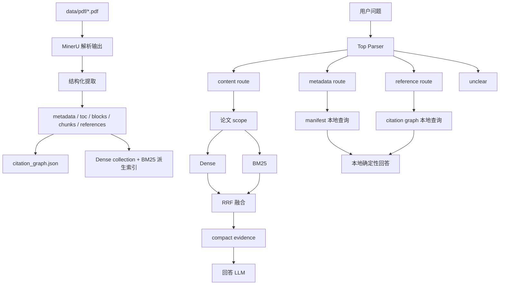

# Paper_RAG

## 1. 项目定位

Paper_RAG 是一个面向本地论文库的结构化 RAG 系统：先把 PDF 转换成可追溯、可重建的数据资产，再根据问题类型选择不同数据源：

- 元数据问题：查本地 `manifest`
- 引用关系问题：查本地 `citation_graph`
- 正文内容问题：先缩小论文范围，再做 Dense + BM25 混合召回，最后交给回答 LLM

### 1.1 核心取舍

最简单的做法是：

```text
PDF -> 文本切块 -> 向量库 -> top-k -> LLM
```

项目没有直接采用该方案：

- “BERT 是哪一年发表的？”不需要正文检索
- “哪些论文引用了 ResNet？”应该查引用图，而不是让 LLM 猜
- “ResNet 的结构是什么？”才需要正文召回
- references 和 Appendix 不应默认污染正文召回
- 论文、年份或 venue 等约束应先做结构化过滤

主链路：

```text
结构化入库 -> 问题路由 -> scope 解析 -> 检索/本地查询 -> evidence -> 回答
```

## 2. 快速运行

### 2.1 常用命令

```powershell
python -m paper_rag ingest
python -m paper_rag index
python -m paper_rag plan "ResNet 的结构是什么？" --debug
python -m paper_rag ask "BERT 的预训练任务是什么？" --evidence
```

命令职责：

| 命令 | 作用 |
|---|---|
| `ingest` | 扫描 PDF，复用或调用 MinerU，生成结构化论文数据，并重建引用图 |
| `index` | 为 `abstract/body` chunks 重建 Dense collection 和 BM25 派生索引 |
| `plan` | 输出路由、检索计划和 evidence |
| `ask` | 执行完整问答 |

辅助入口：`chat` 用于同一进程内连续执行独立问答；`probe` 用于调试 parser、planner、prompt 和正文召回

### 2.2 配置分组

`.env.example` 中的配置可以按用途：

| 配置组 | 主要用途 |
|---|---|
| `MINERU_*` | PDF 解析 |
| `PLAN_PARSER_*` | top parser 和 domain parser |
| `ANSWER_*` | content 回答生成；为空时复用 `PLAN_PARSER_*` |
| `EMBEDDING_*` | Dense 索引和 query embedding |
| `MILVUS_*` | 向量库连接 |
| `PLAN_*` | Dense、BM25、最终 evidence 的 top-k 与 debug block 窗口 |
| `TENCENT_TRANSLATE_*` / `ALIYUN_TRANSLATE_*` | 为中文 BM25 关键词补充英文候选 |

parser 和 answer 都走 OpenAI-compatible `chat/completions`

`PLAN_PARSER_*` 用于输出结构化 JSON；`ANSWER_*` 用于基于 evidence 生成最终中文回答

## 3. 总体架构

### 3.1 数据流



### 3.2 代码模块

```text
paper_rag/
├─ ingest/                 # PDF -> 结构化数据
├─ corpus/                 # 本地语料访问、scope、alias、filter
├─ retrieval/
│  ├─ routes/              # top / metadata / reference / content
│  │  └─ common/           # 共享 parser client、schema、scope router
│  ├─ dense/               # embedding cache、Milvus
│  ├─ sparse/              # BM25
│  ├─ plan.py              # 路由编排
│  ├─ probe.py             # 统一调试入口
│  ├─ timing.py            # debug 耗时统计
│  ├─ evidence.py          # evidence 压缩
│  └─ chunk_fusion.py      # RRF
├─ answer/                 # 本地回答与 LLM 回答
├─ cli/                    # 命令行入口
└─ config.py               # .env -> Settings
```

### 3.3 数据分层

```text
data/
├─ pdf/                       # 原始 PDF
├─ mineru_output/             # MinerU 原始解析结果
├─ manifest.jsonl             # 本地论文事实表
├─ paper_data/
│  ├─ <paper_id>/
│  │  ├─ metadata.json
│  │  ├─ blocks.jsonl
│  │  ├─ chunks.jsonl
│  │  └─ references.jsonl
│  └─ citation_graph.json
└─ index/                     # BM25 与 embedding 派生缓存
```

| 层级 | 内容 | 是否可重建 |
|---|---|---|
| 原始层 | PDF、MinerU 输出 | MinerU 输出可复用 |
| 结构化层 | manifest、metadata、blocks、chunks、references | 可以从原始层重建 |
| 派生层 | citation graph、Milvus、BM25 index、embedding cache | 可以从结构化层重建 |

## 4. 入库流程

### 4.1 主流程

`python -m paper_rag ingest`：

1. 扫描 `data/pdf/*.pdf`
2. 对 PDF 计算 SHA-256，按 hash 去重
3. 用 `manifest.jsonl` 维护论文状态
4. 优先按 hash sidecar 或唯一标题精确匹配复用 MinerU 输出；无法复用时才调用 MinerU API
5. 从 MinerU 内容中抽取标题
6. 用 ArXiv、DBLP、Semantic Scholar 补全元数据
7. 生成 `metadata / toc / blocks / chunks / references`
8. 更新 aliases，并全量重建本地 citation graph

### 4.2 MinerU 解析原理

MinerU 在项目中负责：

```text
PDF -> 结构化 block
```

它不是最终 RAG 数据模型，而是上游 PDF 解析器

核心过程可以理解为：

1. 页面版面分析：识别标题、段落、列表、图片、表格、公式、页眉页脚等区域
2. 阅读顺序恢复：把 PDF 的二维页面恢复成近似论文阅读顺序
3. 内容类型抽取：段落保留文本，图片保留 caption 和 source path，表格保留 HTML 与半结构化文本，公式保留公式文本
4. JSON 输出：项目读取 MinerU 的 `*_content_list_v2.json`，再生成自己的 `blocks / chunks / references`

职责边界：

```text
MinerU：从 PDF 页面中恢复结构化内容单元
Paper_RAG：从内容单元中构建论文数据资产和检索单元
```

### 4.3 元数据补全

外部元数据查询顺序：

```text
ArXiv -> DBLP -> Semantic Scholar
```

| 来源 | 用途 |
|---|---|
| ArXiv | 获取预印本年份和作者 |
| DBLP | 优先获取正式发表 venue 和年份 |
| Semantic Scholar | DBLP 无正式 venue 时兜底 |

最终年份保留两种语义：

```json
{
  "preprint_year": 2015,
  "publish_year": 2016
}
```

这比只保留一个年份更适合回答“首次公开”和“正式发表”两类问题

### 4.4 结构保存

同时保留 block 和 chunk

`blocks.jsonl` 更接近论文结构，用于追溯页码、section、bbox、表格、图片和调试窗口

`chunks.jsonl` 面向召回，用于 Dense 和 BM25

二者分开后：

- 可以调整 chunk 大小，而不破坏原始结构定位
- 检索结果仍能回溯到原 block
- debug 模式可以按 section 扩展前后 block 窗口

### 4.5 Chunk 构建

Chunk 构建规则：

1. 先识别 `abstract / body / appendix / references`
2. references 单独写入 `references.jsonl`
3. chunk 不跨 region，不跨 section
4. 默认目标长度为 `1400` 字符
5. 相邻 chunk 的 Dense 输入带 `200` 字符 overlap
6. 展示文本仍使用当前 chunk 的原始文本，不展示 overlap

Dense 使用的文本不是裸正文，而是：

```text
Paper: <title>
Section: <section path>

<previous overlap>
<current chunk text>
```

这样做的目的：

- 标题提供论文级上下文
- section 提供局部语义
- overlap 减少切块边界损失
- 展示文本保持干净，便于回答引用

### 4.6 图与表格处理

MinerU 将图和表格解析成独立 block，项目同时保留检索文本和来源结构：

| 类型 | 检索文本 | `blocks.jsonl` 保留 | 当前边界 |
|---|---|---|---|
| 图片 | caption | `source_path`、page、bbox、section | 不理解图片像素；无 caption 时不进入 chunk |
| 表格 | caption + 半结构化文本 | 原始 HTML、page、bbox、section | 依赖 MinerU 单元格还原，不执行复杂表格计算 |

表格文本示例：

```text
Table: 模型性能比较
Columns: model, accuracy, parameters.
Row 1: model = ResNet-50; accuracy = 76.2; parameters = 25.6M.
```

HTML 解析失败时退化为去标签文本；超长表格保持完整 block，可能超过默认 chunk 目标长度

### 4.7 Appendix

Appendix 仍然属于论文结构的一部分，因此保留在 `paper_data`，便于追溯和以后扩展

但正文问答只召回：

```text
abstract + body
```

不召回：

```text
appendix + references
```

项目在两个位置做了约束：

1. `paper-rag index` 只把 `abstract/body` 写入 Dense 和 BM25 索引
2. content planner 运行时再次过滤候选 chunk

第二层过滤可以防止旧 Milvus collection 仍然包含 Appendix 时发生泄漏

## 5. Citation Graph

### 5.1 引用关系图

references 不适合混入正文检索：

- 它们会污染 BM25 和 Dense
- 引用关系本身是结构化边
- “谁引用了 ResNet？”可以确定性回答

因此项目把 references 写入 `references.jsonl`，再派生：

```text
data/paper_data/citation_graph.json
```

### 5.2 图结构

```text
source paper --cites--> target paper
```

边会保留：

- source paper id
- target paper id
- reference 原文
- ref index
- 页码
- 来源 block id

### 5.3 保守匹配

一条 reference 只有同时满足下面条件，才会被认为命中本地论文：

1. 规范化标题完整包含
2. 第一作者姓氏命中
3. 预印本年份或正式发表年份命中

设计目标是优先降低误配

代价是：格式异常、标题缺失或作者写法异常时，可能漏掉真实引用

## 6. 查询路由

### 6.1 为什么先路由

不同问题使用不同数据源和执行路径：

| Route | 典型问题 | 数据源与执行方式 | 回答方式 |
|---|---|---|---|
| `metadata` | 作者、年份、venue、数量 | manifest；支持 `lookup/list/count/exists` | 本地确定性回答 |
| `reference` | 谁引用谁、引用数量 | `source_scope --cites--> object_scope` | 本地确定性回答 |
| `content` | 结构、原理、比较、总结 | scope -> Dense + BM25 -> RRF -> contexts | 回答 LLM |
| `unclear` | 非论文问题或语义不明 | 不进入检索 | 本地降级说明 |

顶层链路：

```text
query
  -> top parser
  -> metadata / reference / content / unclear
  -> domain parser
  -> domain planner
  -> evidence
```

Top parser 只负责分路由，不负责一次性解析全部语义

这样做的好处：

- 每条 route 的 schema 更小
- prompt 更专一
- 错误更容易定位
- metadata/reference 不需要进入正文检索

### 6.2 Scope

Scope 表示“先在哪些论文里查”

常见过滤字段：

```text
paper / author / year / venue / title
```

常见 filter 语义：

| 字段 | 常见 op | 含义 |
|---|---|---|
| `paper` | `=` / `follow` / `prior` | 命中某篇论文、某篇论文之后、某篇论文之前 |
| `year` | `=` / `interval` | 按年份或年份区间过滤 |
| `venue` | `=` / `in` | 按会议/期刊过滤，先做 venue alias 规范化 |
| `author` / `title` | `contains` | 作者或标题包含匹配 |

`year interval` 的边界可以是年份、`-inf/inf`，也可以是论文名

例如“ResNet 之后”可以先把 ResNet 解析成本地论文，再取它的发表年份作为区间边界

常见 group 模式：

| 模式 | 含义 |
|---|---|
| `single` | 单一 scope |
| `per` | 每组分别执行并展示 |
| `or` | 多组并集 |
| `and` | 多组都满足，常用于 exists 判断或引用关系交集 |

aliases 和 tags 来自：

```text
data/paper_annotations.json
```

例如用户输入 `ResNet`，scope resolver 可以映射到：

```text
Deep Residual Learning for Image Recognition
```

### 6.3 Prompt 设计

Parser LLM 不负责回答问题，也不直接访问论文数据，只负责把原始问题转换成 planner 可以执行的 JSON

项目采用一层 top prompt 和三条 domain prompt：

```text
原始问题
  -> top prompt：metadata / reference / content / unclear
  -> domain prompt：抽取 intent、scope 和该路由专属字段
  -> schema validator：校验类型与业务约束
  -> resolver / planner：访问本地数据并生成 evidence
```

这种拆分避免让一个大 prompt 同时理解元数据、引用方向和正文检索，降低 schema 规模与字段串路风险

#### 公共 Prompt 结构

三条 domain prompt 都采用相同组织方式：

```text
角色与输出约束
-> JSON Schema
-> 字段核心定义
-> 分类与抽取规则
-> 正反例
-> 输出前校验
```

Metadata、reference、content 复用 `routes/common/prompt.py` 中的 `PAPER_FILTER_SCHEMA` 和 `PAPER_FILTER_RULES`，统一论文范围表达：

```json
{
  "field": "paper|author|year|venue|title",
  "op": "=|contains|interval|in|follow|prior",
  "value": "",
  "negated": false
}
```

公共设计原则：

- `semantic` 只保存无法结构化的论文主题，年份、venue、作者和标题等条件进入 `filters`
- 多个 filter 默认是 AND；OR、分别执行和全部满足使用 `groups + mode`
- 共享条件放顶层 filters，组内特有条件放 `group.filters`
- 同一条件不能同时出现在 semantic、顶层 filters 和 groups
- `paper follow/prior` 表示引用意义上的后续/前期工作，普通“X 之后/之前”表示年份边界
- `paper` 不支持 `in`，并列论文必须拆成独立 group

通用 group 语义为：

| mode | 含义 |
|---|---|
| `single` | 单个论文范围 |
| `per` | 每组分别执行 |
| `or` | 多组取并集 |
| `and` | 多组都要满足，具体限制由各 route 决定 |

#### Top Prompt

Top prompt 只输出：

```json
{"router": "metadata|reference|content|unclear"}
```

它不抽取 filters，也不提前解析 domain intent

冲突消解依据是“最终答案需要什么数据”，而不是问题里出现了哪些修饰词：

| 问题 | Route | 原因 |
|---|---|---|
| “Transformer 后续论文中哪些发表在 CVPR？” | `metadata` | 最终查 venue |
| “Transformer 后续工作有哪些？” | `reference` | 最终查引用关系 |
| “Transformer 后续论文用了哪些数据集？” | `content` | 最终需要读正文 |

数量问题也按统计对象分路由：论文篇数走 metadata，引用/被引数量走 reference，正文中的模块、数据集或实验数量走 content

#### Metadata Prompt

Metadata parser 输出：

```json
{
  "intent": "lookup|list|count|exists|null",
  "return_fields": ["author|year|venue|title"],
  "paper_semantic": "",
  "filters": [],
  "paper_groups": [],
  "group_mode": "single|per|or|and"
}
```

`intent` 与结果形态直接对应：

| intent | 用途 | return_fields |
|---|---|---|
| `lookup` | 查询某篇论文的作者、年份、venue 或标题 | 必须非空 |
| `list` | 列出符合条件的论文 | 默认 `["title"]` |
| `count` | 统计论文篇数 | `[]` |
| `exists` | 判断论文是否存在或是否满足条件 | `[]` |

Metadata 的 `and` 只用于 `exists`，例如“Transformer 和 ResNet 是否都发表在 NeurIPS”

`lookup/exists` 中的裸论文别名可以绑定具体论文，但 `list/count` 不会仅凭大写词或模型名强行绑定单篇论文

#### Reference Prompt

Reference parser 先把所有句式统一为：

```text
source_scope --cites--> object_scope
```

其中 source 是引用发出方，object 是被引用方；`return_side` 决定答案返回哪一侧：

```json
{
  "intent": "list|count|exists|null",
  "return_side": "source|object|null",
  "source_semantic": "",
  "source_filters": [],
  "source_groups": [],
  "source_mode": "single|per|or|and",
  "object_semantic": "",
  "object_filters": [],
  "object_groups": [],
  "object_mode": "single|per|or|and"
}
```

典型判向：

```text
“哪些论文引用了 ResNet？”
source = 待返回论文，object = ResNet，return_side = source

“ResNet 引用了哪些论文？”
source = ResNet，object = 待返回论文，return_side = object

“ResNet 是否引用了 Transformer？”
source = ResNet，object = Transformer，return_side = null
```

Reference prompt 的重点是先判 source/object，再抽取各侧条件，不能根据 `return_side` 反推条件归属

`list/count` 必须指定返回侧，`exists` 只判断边是否存在，因此 `return_side=null`

#### Content Prompt

Content parser 输出：

```json
{
  "intent": "lookup|reason|compare|summary|list|count|exists|null",
  "paper_semantic": "",
  "filters": [],
  "paper_groups": [],
  "group_mode": "single|per|or|and",
  "content_objects": [],
  "compare_objects": []
}
```

它将语义拆成三部分：

```text
intent：要执行什么正文任务
paper scope：先在哪些论文里查
content/compare objects：进入正文后查什么
```

Content intent 有显式优先级：

```text
compare -> exists -> reason -> summary -> list -> count -> lookup
```

例如“是否解释了为什么 shortcut 有效”优先归为 `exists`

其他具体正文事实查询最终落入 `lookup`

当前只处理一个主问题，不拆分包含多个独立任务的复合问题

Prompt 只在强 paper scope 句式下绑定具体论文：

```text
"ViT 这篇论文的结构"     -> paper=ViT
"ViT 的模型结构"         -> content_objects=["ViT", "模型结构"]
"ViT 论文的模型结构"     -> paper=ViT
"BatchNorm 的作用"       -> content_objects=["BatchNorm"]
```

最后一例默认把 BatchNorm 视为方法对象；只有“BatchNorm 这篇论文”“BatchNorm 论文中”等明确表达才绑定论文，降低方法名与论文别名之间的误判

比较问题中，`compare_objects` 保存被比较对象，`content_objects` 只保存原问题明确给出的比较维度：

```text
“比较 BasicBlock 和 Bottleneck 的结构差异”

intent = "compare"
compare_objects = ["BasicBlock", "Bottleneck"]
content_objects = ["模型结构"]
```

解析结果随后生成两套检索 query：`intent + objects` 改写成自然语言 Dense query；对象词及翻译候选形成 BM25 queries；已经进入 scope 的标题、别名和结构化条件会从检索词中排除

#### Prompt 与代码校验的边界

Prompt 负责语义判断，schema validator 不重新理解自然语言，只检查确定性约束：

- 拒绝 schema 外字段、非法枚举和错误 filter/operator 组合
- 校验 `groups` 与 `mode` 是否一致
- metadata 校验 intent 与 `return_fields`
- reference 校验 intent 与 `return_side`
- content 校验 compare 对象数量、对象去重，以及 `count/exists` 是否有检索对象

之后 resolver 才负责别名匹配、年份边界解析和真实论文记录查询

因此整体职责是：

```text
Prompt 做语义抽取
Schema 做格式与业务不变量校验
Resolver 做本地实体解析
Planner 做确定性查询或正文检索
```

这种分层让 prompt 可以迭代语义规则，又不会把 LLM 输出直接当作可信执行结果

## 7. Content 混合检索

### 7.1 先缩小论文范围

Content planner 不会一上来扫描整个论文库

它先根据 paper aliases、filters 和 groups 得到候选论文，再只保留这些论文的 `abstract/body` chunks

`per/and` 分组会逐组检索，避免某一组的 top-k 覆盖其他组；`or/single` 仍按合并后的 scope 检索

同时：

- Dense 通过 Milvus `paper_id in [...]` 做标量过滤
- BM25 通过 `allowed_chunk_ids` 限定统计和打分范围

结构化条件交给 scope 层，正文相关性才交给检索层

### 7.2 Dense Query 与 BM25 Query

Dense 和 BM25 需要不同风格的 query

Dense query 保持自然语言语义，例如：

```text
查找论文中关于模型结构的相关内容
```

BM25 query 更偏关键词，例如：

```text
模型结构
structure
```

已经进入 scope 的论文标题、别名、年份和 venue 会从 BM25 query 中剔除，避免重复强调范围词

中文关键词可以调用腾讯云或阿里云翻译，补充英文候选

翻译失败只写 warning，不会阻断主链路

### 7.3 Dense Retrieval

Dense 将 `chunk.embedding_text` 和 `dense_query` 转成向量，在 Milvus 中使用 COSINE 检索语义相近片段

余弦相似度：

$$
\operatorname{cos}(q,d)=
\frac{q \cdot d}
{\lVert q \rVert_2 \lVert d \rVert_2}
$$
其中：

- $q$：query embedding
- $d$：chunk embedding
- 分数越高，语义越相似

### 7.4 BM25

BM25 适合补充关键词精确匹配

项目中的 BM25 文档文本为：

```text
chunk.text + chunk.embedding_text
```

单个 token 的 IDF：衡量 token 在整个语料库中有多稀有

$$
\operatorname{idf}(t)
=
\log\left(
1+
\frac{N-df(t)+0.5}
{df(t)+0.5}
\right)
$$

词频归一化：衡量 token 在某篇文档中出现得多不多，但会做饱和和文档长度校正

$$
\operatorname{tfNorm}(t,d)
=
\frac{
f(t,d)(k_1+1)
}{
f(t,d)+k_1\left(1-b+b\frac{|d|}{\operatorname{avgdl}}\right)
}
$$

最终分数：

$$
\operatorname{BM25}(q,d)
=
\sum_{t \in q}
\operatorname{idf}(t)
\cdot
\operatorname{tfNorm}(t,d)
$$

符号说明：

| 符号 | 含义 |
|---|---|
| $N$ | 当前 scope 内 chunk 数 |
| $df(t)$ | 当前 scope 内包含 token $t$ 的 chunk 数 |
| $f(t,d)$ | token $t$ 在 chunk $d$ 中的词频 |
| $\lvert d \rvert$ | chunk token 数 |
| $\operatorname{avgdl}$ | 当前 scope 内平均 chunk 长度 |
| $k_1$ | 词频饱和参数，项目中为 `1.5` |
| $b$ | 长度归一化强度，项目中为 `0.75` |

关键点：

> BM25 的 $N$、$df(t)$ 和 $\operatorname{avgdl}$ 按当前论文 scope 计算，而不是直接使用全库统计量

这样用户只查 ResNet 时，IDF 语义来自 ResNet 的候选 chunks


### 7.5 RRF 融合

项目没有直接比较 Dense score 和 BM25 score，因为两者不在同一个数值空间

使用 Reciprocal Rank Fusion：

$$
\operatorname{RRF}(d)=
\sum_{i=1}^{m}
\frac{1}
{k+\operatorname{rank}_i(d)}
$$

其中：

- $d$：候选 chunk
- $\operatorname{rank}_i(d)$：候选在第 $i$ 个检索列表中的排名
- $k$：平滑系数，项目中为 `60`

项目做两层 RRF：

1. 多个 BM25 query 之间先融合
2. BM25 候选与 Dense 候选再次融合

RRF 的好处：

- 不需要手工归一化 Dense 和 BM25 分数
- 同时被两路命中的 chunk 会自然提升
- 对某一路分数尺度变化不敏感

### 7.6 Dense 与 BM25 的分工

| 场景 | Dense | BM25 |
|---|---|---|
| 概念解释 | 强 | 中 |
| 同义表达 | 强 | 弱 |
| 英文专有名词 | 中 | 强 |
| 缩写、模型名、数据集名 | 中 | 强 |
| 服务不可用时 | 依赖外部服务 | 本地可继续工作 |

二者不是互相替代，而是互补

## 8. Evidence 与回答生成

### 8.1 压缩 Evidence

Planner 的内部状态很多：

- parser 原始结果
- RouteDecision
- scope records
- Dense / BM25 来源
- scores
- block 扩展窗口

这些信息不应该默认全部塞给回答 LLM

默认 content evidence 只保留：

- chunk id
- 论文标题
- section path
- 页码
- 命中 chunk 及其邻接 block window 文本

`--debug` 时才附加：

- parser 中间态
- scope records
- retrieval query
- timings
- sources 和 scores
- expanded blocks

这样做可以：

- 减少回答 prompt 体积
- 避免内部路径、hash 和 raw records 泄漏
- 让 debug 信息仍然可追溯

### 8.2 回答策略

| Route | 回答方式 |
|---|---|
| `metadata` | 本地确定性回答 |
| `reference` | 本地确定性回答 |
| `content` | 基于 compact evidence 调用回答 LLM |
| `unclear` / `parse_failed` | 本地降级说明 |

这样可以减少 LLM 幻觉：

- 年份、作者、venue 不需要 LLM 编造
- 引用边不需要 LLM 推断
- 只有正文综合表达才交给 LLM

### 8.3 失败降级

项目对常见故障做了降级：

| 故障 | 行为 |
|---|---|
| parser 配置缺失或返回非法结构 | 返回 `parse_failed` |
| top parser 无法判断问题 | 返回 `unclear` |
| citation graph 缺失 | 提示先执行 `ingest` |
| Dense 调用失败 | 写 warning，继续使用 BM25 |
| 翻译失败 | 写 warning，继续使用原 BM25 关键词 |
| answer LLM 失败 | 返回本地降级说明 |

OpenAI-compatible 服务的兼容处理：

- parser 优先要求 `response_format={"type":"json_object"}`，不支持时回退普通 JSON prompt
- answer 优先发送 `enable_thinking=false`，不支持时移除该字段重试

## 9. 工程优化与权衡

### 9.1 优化总结

| 优化 | 实现 | 收益与语义边界 |
|---|---|---|
| Scope First | 先解析论文范围<br />Dense 使用 `paper_id` 标量过滤<br />BM25 使用 `allowed_chunk_ids` | 减少无关候选；结构化范围决定“在哪查”，检索分数只决定“哪些正文相关” |
| BM25 派生索引 | 保存 `doc_id / text_hash / tokens`<br />临时文件写完后原子替换 | 避免重复分词<br />查询时仍按当前 scope 计算，不改变排序语义 |
| Dense staging | 先写临时 collection，再把正式名 alias 切过去 | 插入失败时不先删除旧 collection |
| `CorpusContext` | 懒加载并复用 manifest、annotations、chunks、citation graph 和 BM25 index | 减少一次命令或 `chat` 会话内的重复 IO；不是全局常驻缓存 |
| Embedding Cache | chunk/query 分离缓存，按 `model + dimensions + text` 生成 key，append-only 写入 | 避免重复向量化<br />模型或维度变化后不会误用旧向量 |

### 9.2 主要耗时

完整 content `ask` 仍然会调用：

1. top parser
2. domain parser
3. 可选翻译服务
4. embedding 服务
5. Milvus
6. answer LLM

因此端到端耗时主要受外部服务影响

排查时使用：

```powershell
python -m paper_rag ask "ResNet 的结构是什么？" --debug
```

重点查看：

```text
debug.timings_ms
```

## 10. 当前边界

1. Reference 只覆盖本地库

   Citation graph 只描述当前本地论文库中的引用关系，不是全网 citation network

2. Citation Graph 可能漏召回

   引用匹配偏保守，优先减少误配

   如果 reference 原文格式异常、标题不完整或作者写法异常，可能漏掉真实边

3. Content 质量依赖上游

   正文回答质量依赖：

   - MinerU 解析质量
   - region 边界识别
   - chunk 切分
   - scope 解析
   - Dense / BM25 召回
   - 回答 LLM

4. BM25 更适合英文论文

   论文正文以英文为主，中文 query 可以通过翻译候选增强 BM25，但翻译不是强依赖

5. Appendix 暂不参与正文回答

   当前保留但不参与 content 召回

   如果未来需要回答附录问题，更合理的做法是新增显式 appendix route 或检索开关，而不是默认混入正文

## 11. 面试自测

### 11.1 项目主线

1. 为什么不是所有问题都走向量检索？

   因为问题类型不同，最可靠的数据源也不同

   年份、作者、venue 这类问题应该查 `manifest`；

   引用关系应该查 `citation_graph`；

   只有需要理解正文内容时才进入 Dense / BM25 检索

   全部走向量检索会增加成本，也容易让 references、Appendix 或无关 chunk 污染答案

3. 为什么 top parser 和 domain parser 要分两层？

   每个 parser 的 schema 更小，prompt 更专一，错误更容易定位，也避免 metadata/reference 问题被过早拉进正文检索链路

5. 为什么当前只用 RRF，没有引入 Reranker？

   RRF 用排名而不是原始分数融合 Dense 和 BM25，避免了两路分数尺度不一致的问题

   对于当前本地论文库和候选集规模，它在检索效果、延迟和可解释性之间已经比较平衡

   Reranker 会增加一次候选重排，还会引入模型依赖、推理延迟和显存或 API 成本

   目前项目也没有专门的相关性标注集来证明它能稳定提升效果，因此没有为了架构完整而强行加入

   如果后续语料规模扩大、相似候选增多，或者离线评测证明 RRF 排序成为瓶颈，可以在 RRF 召回后增加 Reranker，只对较小的候选集做精排

### 11.2 继续改进

可以继续讨论：

- 为 Appendix 增加显式路由
- 引入 reranker
- 为 citation graph 增加更强的引用解析器
- 为 metadata 和 scope parser 增加更系统的离线评测集
- 将 embedding cache 从 append-only JSONL 升级为 SQLite 或 KV 存储
- 对外部 parser、embedding 和 answer LLM 增加并发、重试与熔断策略
